# Huffman Codes

The Huffman Codes is a prefix-free data compression algorithm that uses variable-length code.

Its major characteristics is that it uses the frequency of each character in the input to construct a binary tree, which will later form the decoding table, however, this means the algorithm requires two passes; first to determine the frequencies of each character, and second to perform the encoding.

## Encoding

We use the following input

$$
\begin{align*}
\text{AZABBRAKADABRAA}
\end{align*}
$$

for our demonstration.

Firstly, we need to determine the frequencies of each character. With which we obtain the following;

| Character | Frequency |
| --------- | --------- |
| A         | 7         |
| B         | 3         |
| D         | 1         |
| K         | 1         |
| R         | 2         |
| Z         | 1         |

Next, we will construct a binary tree based.  To do so, we will use a minimum priority queue using the frequencies. To avoid confusion, we will also label these frequencies. 

In this particular input, we have a few characters with the same frequency. We will insert them in the alphabetical order, but this is done for the sake of convention. We can pick an arbitrary order for characters with equal frequencies.

We obtain the following minimum priority queue;

$$
\begin{matrix*}
\langle &1 & 1 & 1 & 2 & 3 & 7 &\rangle\\
& D & K & Z & R  & B& A
\end{matrix*}
$$

Along side the queue, we also construct the binary tree that will become the decoding table. In this first step, we simply represent each character as an individual trees.

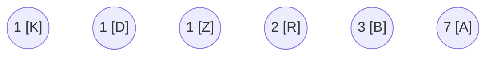

Next, we consider the first two elements in the queue, we combine them to form a new label and insert the sum of their frequencies into the correct position in the queue. In this example, we combine $K$ and $D$ to form $DK$ with frequency of two. 

Once again, the order of each label does not matter as long as the frequencies are inserted correctly.

$$
\begin{matrix*}
\langle &1 & 2 & 2 & 3 & 7 &\rangle\\
& Z & DK & R  & B& A
\end{matrix*}
$$

In the binary tree, we create a new node $DK$ whose children are $D$ and $K$. We will label the left child using $0$ and right child to be $1$, but these choices are arbitrary.

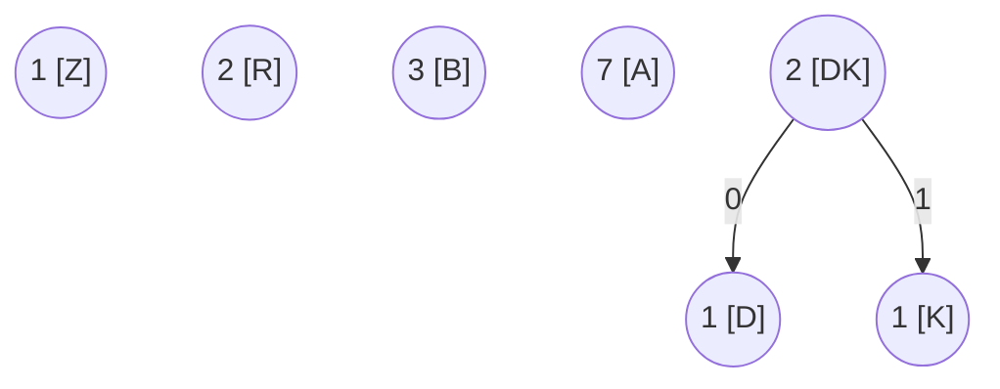

We repeat this step for until we only have one element left in the queue. We consider now, $Z$ and $DK$, combine them into $ZDK$ with frequency of three.

$$
\begin{matrix*}
\langle & 2 & 3 & 3 & 7 &\rangle\\
& R & ZDK  & B& A
\end{matrix*}
$$

We construct a new node $ZDK$ whose children are $Z$ and $DK$. For the sake of consistency, we will label the child with higher frequency as $1$ and $0$ for child with lower frequency.


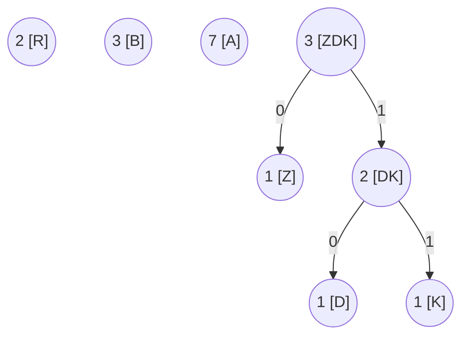

Next, we consider $R$ and $ZDK$, combine them;

$$
\begin{matrix*}
\langle & 3 & 5 & 7 &\rangle\\
& B & RZDK  & A
\end{matrix*}
$$

In the binary tree, we create a new node $RZDK$ whose children are $R$ and $ZDK$.

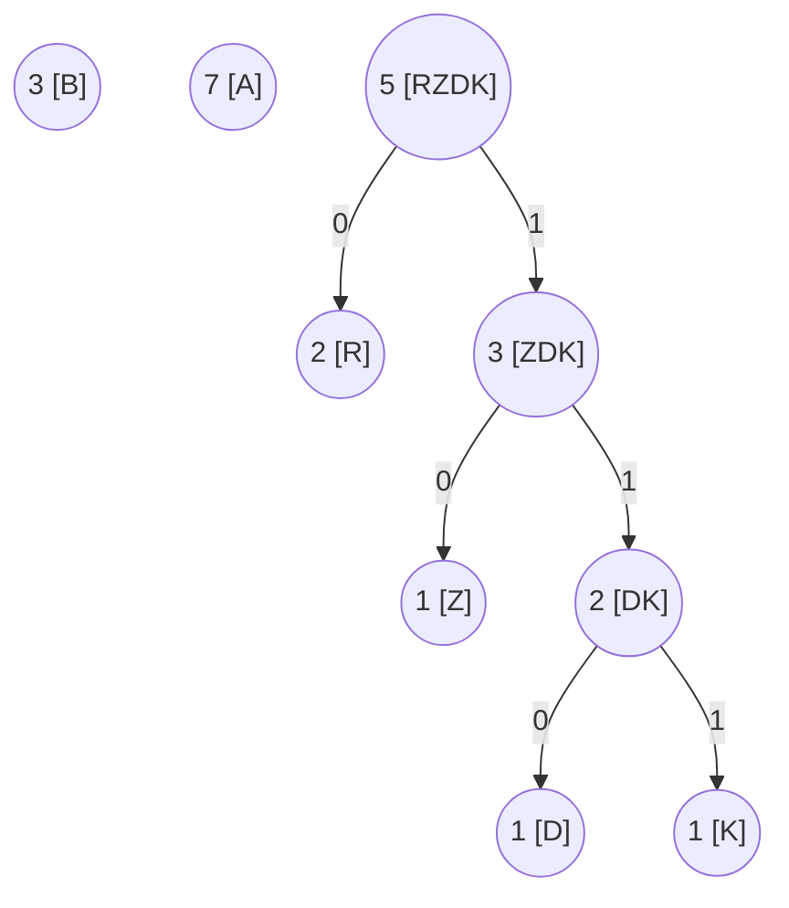

Next, we combine $B$ and $RZDK$.

$$
\begin{matrix*}
\langle & 7 & 8 &\rangle\\
& A & BRZDK 
\end{matrix*}
$$

In the binary tree, we construct a new node $BRZDK$.

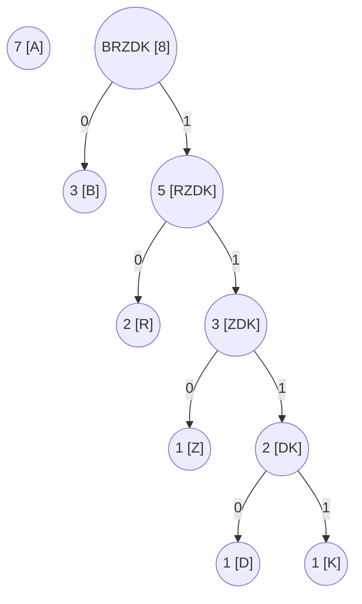

Lastly, we combine $A$ and $BRZDK$.

$$
\begin{matrix*}
\langle & 15  &\rangle\\
& ABRZDK 
\end{matrix*}
$$

We obtain the following binary tree;

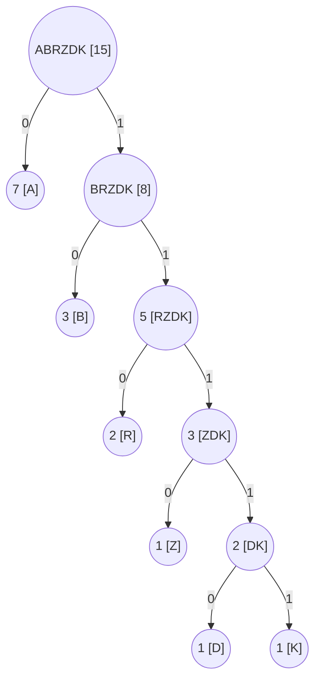

Using this example, it is possible to arrive a different binary tree by picking different pairs of label during combination. For example, we can also obtain the following binary tree;

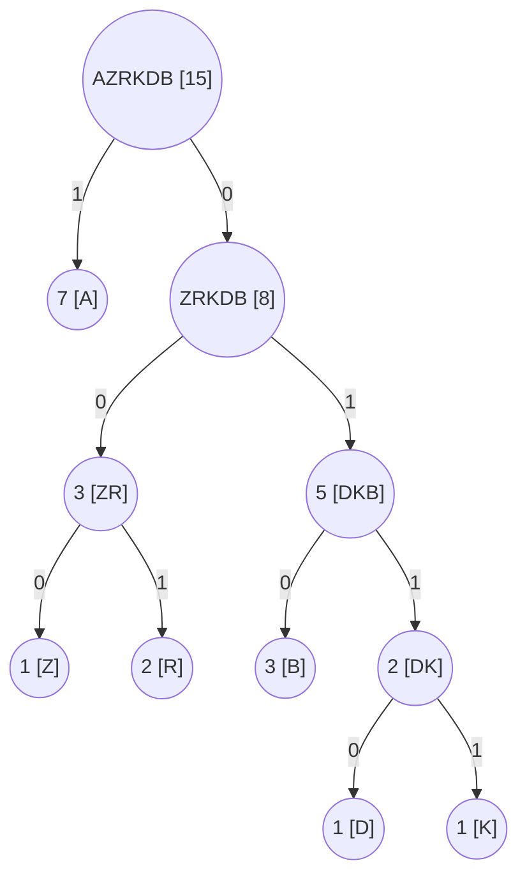

With this step, we construct the decoding table by traveling down to each character using the binary tree. For example; we obtain $A$ by simply taking $0$, but we obtain $K$ by $11111$.

We obtain the following table;

| Character | Code  |
| --------- | ----- |
| A         | 0     |
| B         | 10    |
| R         | 110   |
| Z         | 1110  |
| D         | 11110 |
| K         | 11111 |

By this point, we have completed the first step of our encoding process which is constructing the decode table. For the next step, we will look over each character in the input again, and encoding. Here is the result after a few encoding a few characters with spaces included for readability.

$$
\begin{matrix*}
0 & 1110 & 0  & 10 & 10 & 110 &\ldots\\
A & Z & A & B& B& R & \ldots\\
\end{matrix*}
$$

However, it is important to mention that our choice of pair is suboptimal since we pick each pair arbitrary. In practice, we want to choose pairs of labels that minimizes the depth of the binary tree when possible.

## Decoding

We need to decode table along with the encoded text to obtain the original input. To decode, we look at each bit and try to match it against one of the code in the table, if we find a exact match, we decode to the original character. Else, we collect a longer substring to match against.

| Character | Code  |
| --------- | ----- |
| A         | 0     |
| B         | 10    |
| R         | 110   |
| Z         | 1110  |
| D         | 11110 |
| K         | 11111 |

Using the same encoded text from our encoding step;

$$
\begin{align*}
011100 10  10 110 \ldots\\
\end{align*}
$$

First we consider $0$ and we find the exact match to be $A$.

$$
\begin{align*}
&\underline{0}11100 10  10 110 \ldots\\
&A
\end{align*}
$$

Next consider $1$, but we cannot find an exact match;

$$
\begin{align*}
&0\underline{1}1100 10  10 110 \ldots\\
&A
\end{align*}
$$

We consider $11$, but we cannot find an exact match;

$$
\begin{align*}
&0\underline{11}100 10  10 110 \ldots\\
&A
\end{align*}
$$

We consider $111$, but we cannot find an exact match;

$$
\begin{align*}
&0\underline{111}00 10  10 110 \ldots\\
&A
\end{align*}
$$


We consider $1110$, and we match it with $Z$.

$$
\begin{align*}
&0\underline{1110}0 10  10 110 \ldots\\
&AZ \\
\end{align*}
$$

Next we consider $0$ and match it with $A$.

$$
\begin{align*}
&01110\underline{0} 10  10 110 \ldots\\
&AZA \\
\end{align*}
$$

And we repeat this step until the we have exhausted the encoded bits. 


## Additional Example

### Example 1

Consider the input

$$
\begin{align*}
MATEKFELELETEMKETTESLETT
\end{align*}
$$

Let's encode it using Huffman Codes.

**Encoding**

First, we determine the frequency of each character. We obtain the following table;

| Character | Frequency |
| --------- | --------- |
| E         | 8         |
| T         | 6         |
| L         | 3         |
| M         | 2         |
| K         | 2         |
| A         | 1         |
| F         | 1         |
| S         | 1         |

We initialize the minimum priority queue and the binary tree. 

$$
\begin{matrix*}
\langle & 1 & 1 & 1 & 2 & 2 &3 & 6 & 8 &\rangle\\
& S & F & A & K & M & L & T & E&
\end{matrix*}
$$

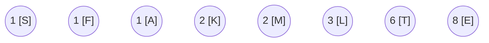

We combine $S$ and $F$.

$$
\begin{matrix*}
\langle & 1 & 2 & 2 & 2 &3 & 6 & 8 &\rangle\\
        & A & SF& K & M & L & T & E&
\end{matrix*}
$$

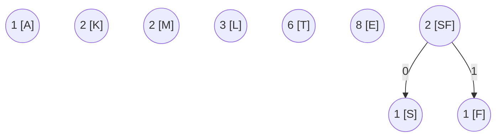


We combine $A$ and $K$.

$$
\begin{matrix*}
\langle & 2  & 2 & 3  & 3 & 6 & 8 &\rangle\\
        & SF & M & AK & L & T & E&
\end{matrix*}
$$

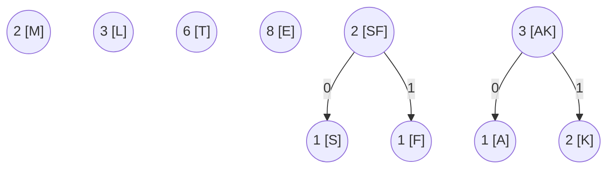

We combine $SF$ and $M$.

$$
\begin{matrix*}
\langle & 3  &3& 4   & 6 & 8 &\rangle\\
        & AK &L &MSF & T & E&
\end{matrix*}
$$

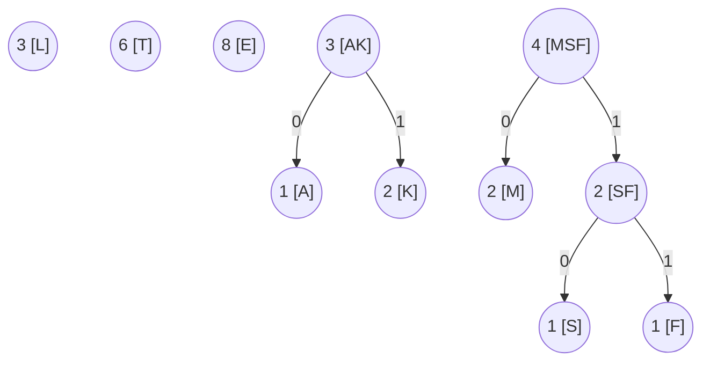

We combine $MSF$ and $T$.

$$
\begin{matrix*}
\langle & 6  & 8  & 10&\rangle\\
        & LAK& E  & MSFT& 
\end{matrix*}
$$

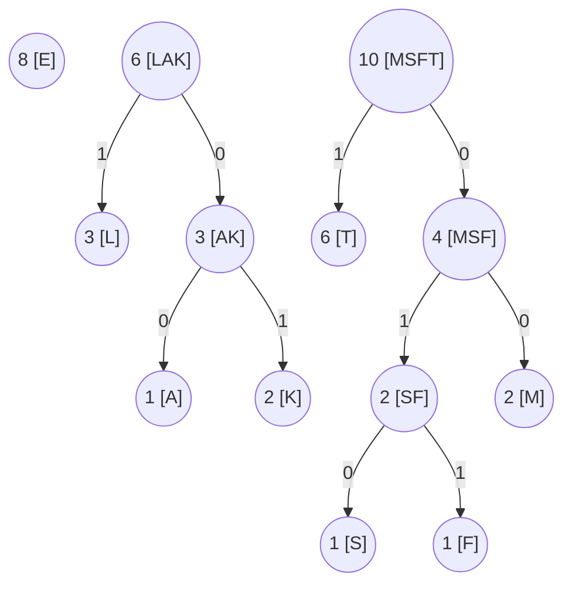


We combine $LAK$ and $E$.

$$
\begin{matrix*}
\langle & 10  & 14 &\rangle\\
        & MSFT& LAKE&
\end{matrix*}
$$

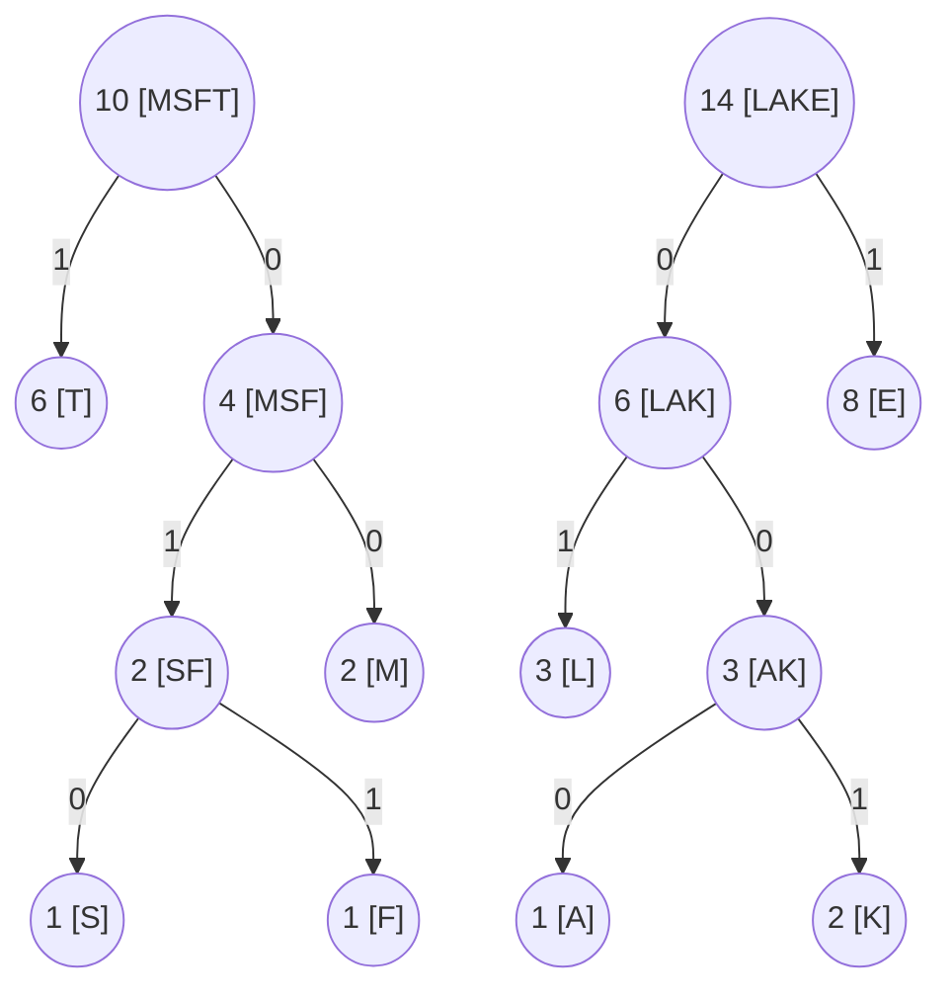

We combine $MSFT$ and $LAKE$.

$$
\begin{matrix*}
\langle & 24  &\rangle\\
        & MSFTLAKE
\end{matrix*}
$$

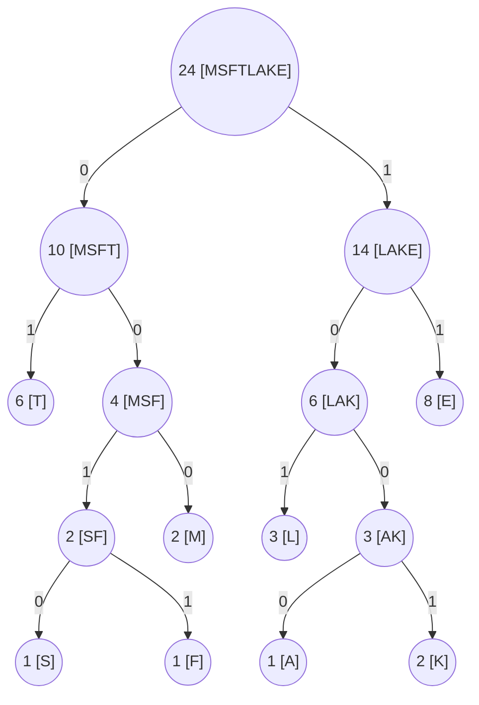

We have the following decode table

| Character | Code |
| --------- | ---- |
| T         | 01   |
| S         | 0010 |
| F         | 0011 |
| M         | 000  |
| L         | 101  |
| A         | 1000 |
| K         | 1001 |
| E         | 11   |

Next, we encode the input 

$$
\begin{align*}
MATEKFELELETEMKETTESLETT
\end{align*}
$$

```
000 1000 01 11 1001 0011 11  101 11 101 11 01 11 000 1001 11 01 01 11 0010 101 11 01 01 
```

### Example 2

Let's try to construct a decode table and decode the following text, where the zero marks the child with lower frequency and one marks the child with higher frequency.

```
R:2, T:4, O:5, G:7, E:13, and A:17
```

We have the following priority queue;

$$
\begin{matrix*}
\langle & 2 & 4 & 5 & 7 & 13 & 17 & \rangle\\
& R & T & O & G & E & A\\
\langle & 5 & 6 & 7 & 13 & 17 & \rangle\\
        & O & RT & G & E & A\\
\langle & 7  & 11 & 13 & 17 & \rangle\\
        & G & ORT & E & A\\
\langle & 13 & 17 & 18 & \rangle\\
        & E & A & GORT &\\
\langle & 18 & 30 & \rangle\\
        & GORT & EA &\\
\langle & 48 & \rangle\\
        & GORTEA &\\
\end{matrix*}
$$

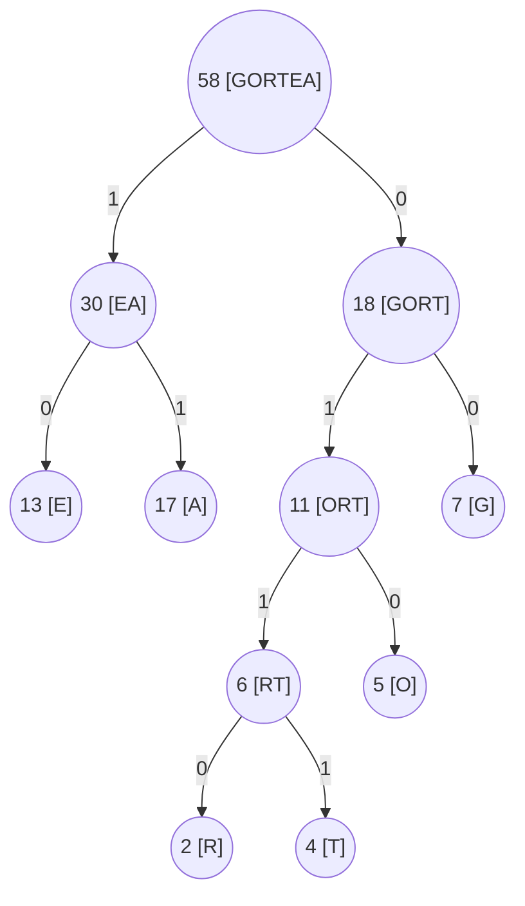

We have the following decode table

| Character | Code |
| --------- | ---- |
| E         | 10   |
| A         | 11   |
| R         | 0110 |
| T         | 0111 |
| O         | 010  |
| G         | 00   |

Let's try to decode the following string;

$$
\begin{align*}
0111 1100 0100 1101 0
\end{align*}
$$

We have

$$
\begin{matrix*}
0111 & 11 &00 & 010 & 0110 &1 0&\ldots\\
T & A & G & O & R & E \
\end{matrix*}
$$