# AVL tree

## Overview

**Definition**: An AVL tree, abbreviated from  Adelson-Velsky and Landis, is **binary search tree** with the **AVL tree** property. 

**Definition**: A binary search tree is said to satisfy the **AVL tree** property if, for each node, the heights of the left and right subtree differ by at most one.

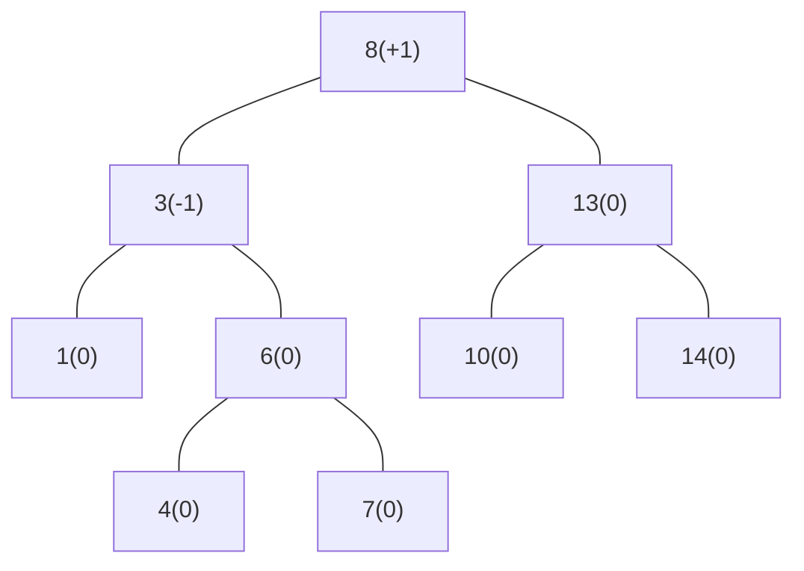

## Balance factor

**Definition**: In a binary tree, the **balance factor** of a node $X$, denoted by $BF(X)\to\{-1,0,1\}$, is defined as:

$$
BF(X) = \text{Height}(X.\text{right}) - \text{Height}(X.\text{left}).
$$

**Definition**: A node $X$ is said to be **left-heavy** if $BF(X)\lt 0$.

**Definition**: A node $X$ is said to be **right-heavy** if $BF(X)\gt 0$.

**Definition**: A node $X$ is said to be **balanced** if $BF(X)=0$.

## Operations

### SEARCH

**Definition**: The **SEARCH** operation looks for a specific key in an AVL tree. In an AVL tree with $n$ nodes, the time complexity is $O(\log n)$.

### ROTATE RIGHT

**Definition**: The **ROTATE RIGHT** operation takes a node $X$ in a tree and rotate it to the right.

Right rotated with $X$ as pivot:

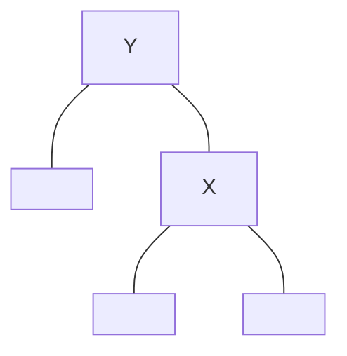

### ROTATE LEFT

**Definition**: The **ROTATE LEFT** operation takes a node "X" in a tree and rotate it to the left.

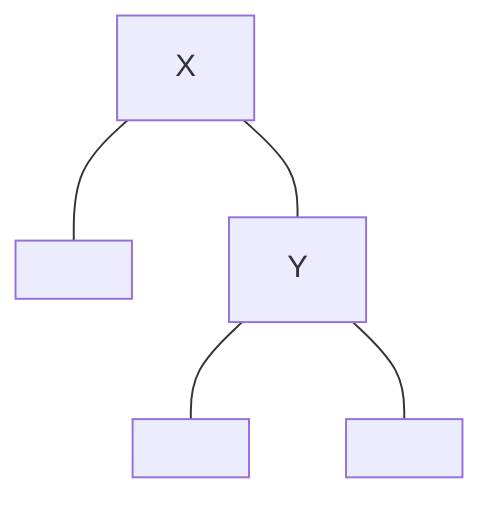

Left rotated with "X" as pivot:

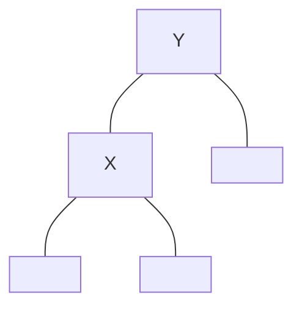

### INSERT

**Definition**: The **INSERT** operation inserts an element into an AVL tree following the same process as binary search tree. 

After insertion, it is possible that the AVL tree property is violated. There are four possible violations after inserting an element $X$.

**[-2, -1] violation**

The grand parent of $X$ has -2 balancing factor, and the parent of $X$ has -1 balancing factor. To restore the property from this type of violation, perform **ROTATE RIGHT** on the parent of $X$.

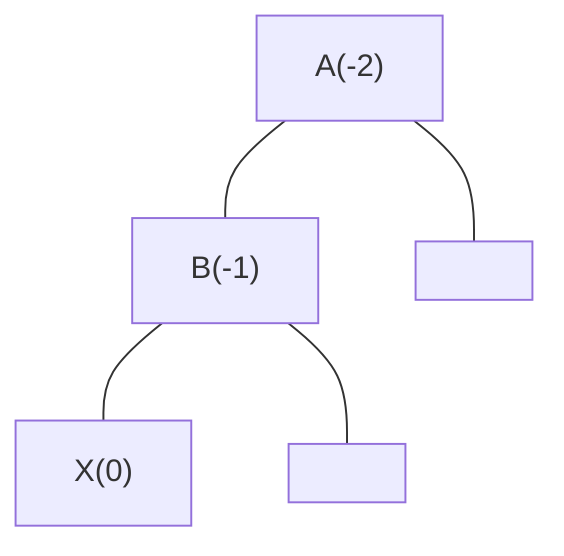

Right rotated on $B$:

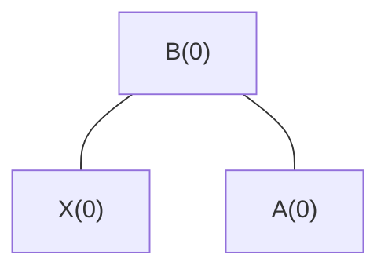

**[2, 1] violation**

The grand parent of $X$ has 2 balancing factor, and the parent of $X$ has 1 balancing factor. To restore the property from this type of violation, perform **ROTATE LEFT** on the parent of $X$.

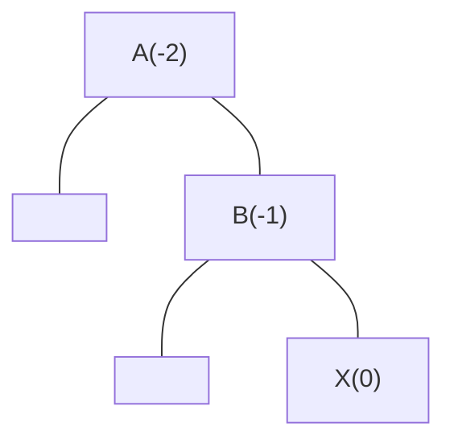

Left rotated on $B$:

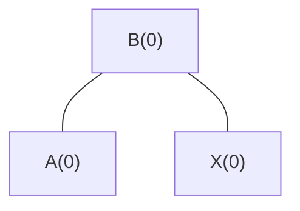

**[2, -1] violation**

The grand parent of $X$ has 2 balancing factor, and the parent of $X$ has -1 balancing factor. To restore the property from this type of violation, perform **ROTATE RIGHT** on the parent of $X$, then perform **ROTATE LEFT** on the parent of $X$ which was previously the grand parent.

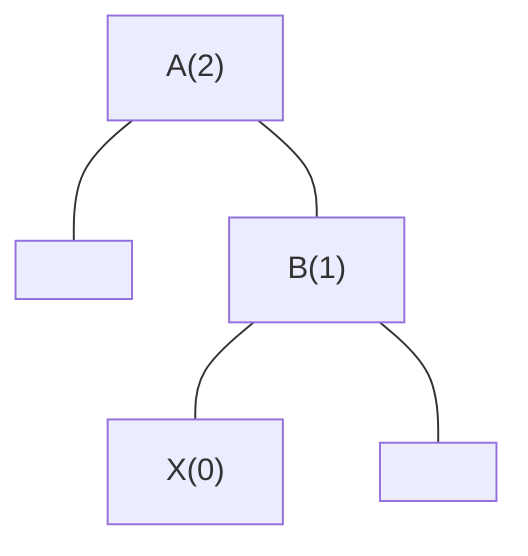

Right rotated on $B$:

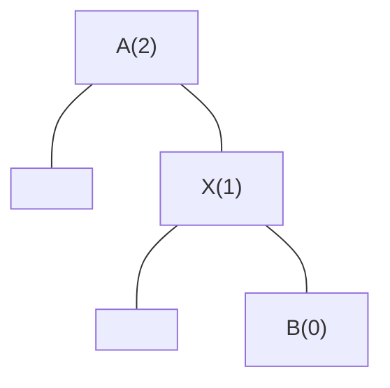

Left rotated on $A$:

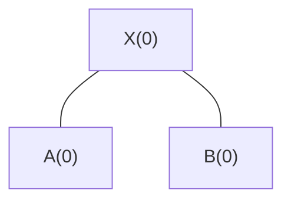

**[-2, 1] violation**

The grand parent of $X$ has -2 balancing factor, and the parent of $X$ has 1 balancing factor. To restore the property from this type of violation, perform **ROTATE LEFT** on the parent of $X$, then perform **ROTATE RIGHT** on the parent of $X$ which was previously the grand parent.

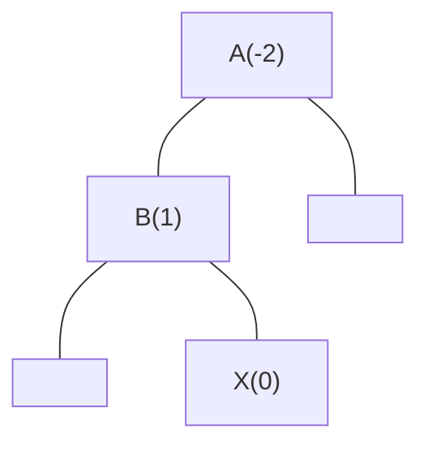

Left rotated on $B$:

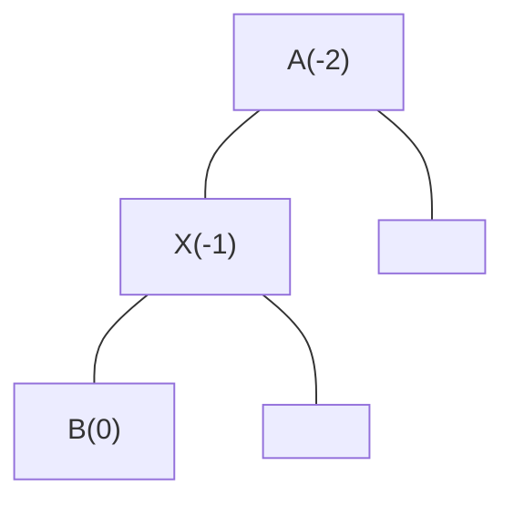

Right rotated on $A$:

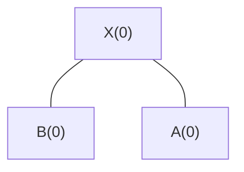

### DELETE

**Definition**: The **DELET** operation removes an element from an AVL tree following the same process as binary search tree. 

After deletion, the restoration begins by examining the parent of the newly inserted node.
- If there is no violation, then the AVL tree is balanced.
- Otherwise, the parent is balanced using rotations.

If the parent has been rebalanced, it is necessary to examine the grandparent for violation.
- If there is no violation, then the AVL tree is balanced.
- Otherwise, the grandparent is balanced using rotations.

If the grandparent has been rebalanced, it is necessary to examine the great grandparent, and so on. This process is repeated until there is no violation, or the root is balanced which is the worst case.