# B-plus tree

## Overview

**Definition**: A **B+ tree** is a **balanced**, but no necessary **binary**, search tree.

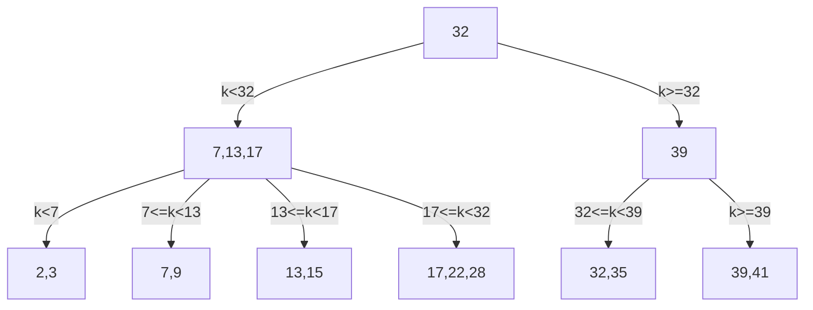

**Definition**: An index node contains references to other index nodes or leaves, but not the actual data in memory.

**Definition**: A leaf node contains references to the actual data in memory, but no reference to other index nodes or other leaves.

**Theorem**: Every every leaf is the same distance away from the root.

**Theorem**: The root is treated as an index node. It is not possible for the root to have one reference. Either it contains zero reference or at least two.

## Degree

**Definition**: Every B+ tree has a parameter called **degree** $d$. It represents the maximum number of references a node contains. Every node can contain at most $d-1$ keys and at most $d$ references. 

Physically, it represents the size of a page, which depends on the hardware limitation and implementation.

**Theorem**: Non-root index nodes have at least $\lfloor \frac{d}{2}\rfloor$ pointers and $\lfloor \frac{d}{2}\rfloor + 1$ keys.

**Theorem**: Leaves have at least $\lfloor \frac{d}{2}\rfloor$ key-value pairs.

## Operations

### SEARCH

**Definition**: The **SEARCH** operation looks for a element in a B+ tree. The steps taken is similar to that of binary search tree, but each node can have up to $d$ paths instead of two.

### INSERT

**Definition**: The **INSERT** operation inserts an element into a tree at a leaf.

It is possible that the desired leaf has $d$ keys already, so the key cannot be inserted into the leaf. In such a case, additional steps have to be taken to make room for additional keys.

Insertion begins by searching for the desired leaf.
- If the desired leaf is not full, the key is inserted into the leaf.
- Otherwise, split the leaf into two leaves. The left leaf contains the first $\left\lceil\frac{d}{2}\right\rceil$ keys and the other half of the keys goes to the right leaf. The smallest key on the right leaf is added to their parent.
	- If the parent is not full, then the key is added into the parent.
	- Otherwise, the parent is split into two index nodes. The left index node contains the first $\left\lceil\frac{d}{2}\right\rceil$ keys on the parent and the rest goes to the right index node. The smallest key on the right index node is removed, and added into grandparent. This step is repeated in the great grandparent level, and so on.

The steps involved in building a B+ tree with $d=4$ from the following input goes as follows:

**Input**: 15, 7 30, 20, 40, 25, 2, 5, 29, 23

**Step**: Insert 15

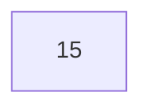

**Step**: Insert 7

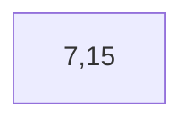

**Step**: Insert 30

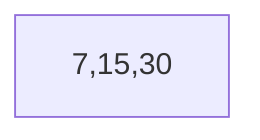

**Step**: Insert 20

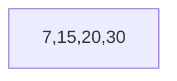

**Step**: After inserting 20, a vertex contains 4 keys and is overloaded, split the vertex, and insert the smallest key on the right into the parent.

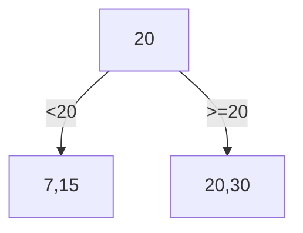

**Step**: Insert 40

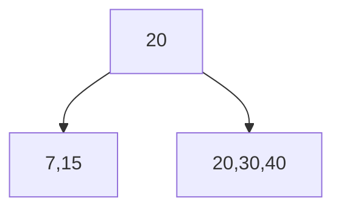

**Step**: Insert 25

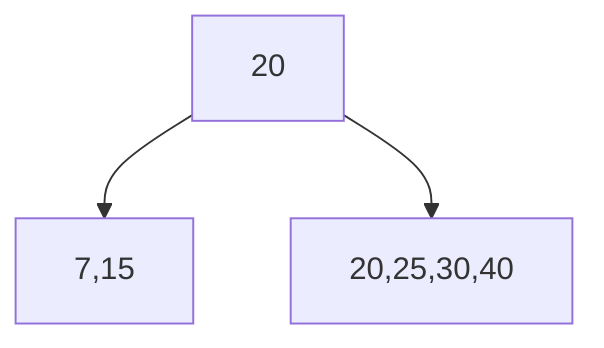

**Step**: After inserting 25, a vertex contains 4 keys and is overloaded, split it, and insert the smallest key on the right side into the parent.

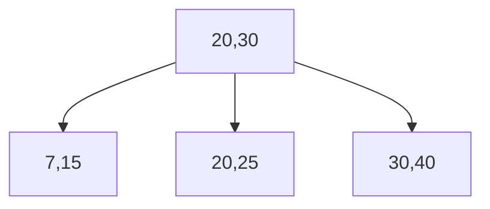

**Step**: Insert 2

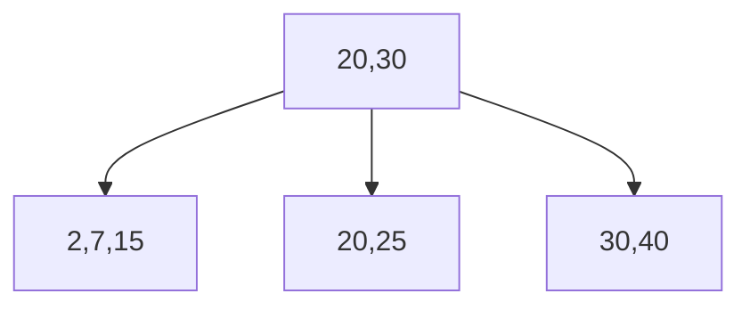

**Step**: Insert 5

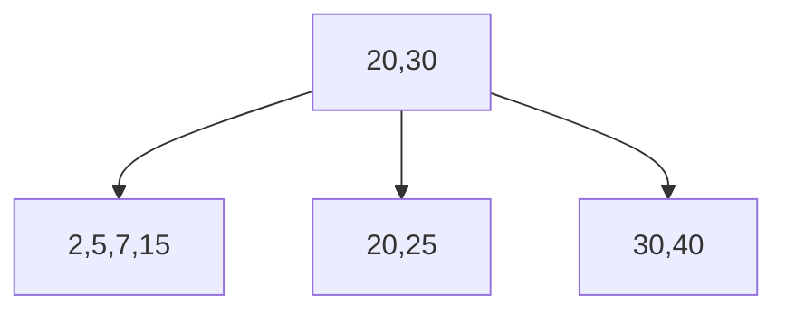

**Step**: After inserting 5, a vertex contains 4 keys and is overloaded, split it, and insert the smallest key on the right side into the parent.

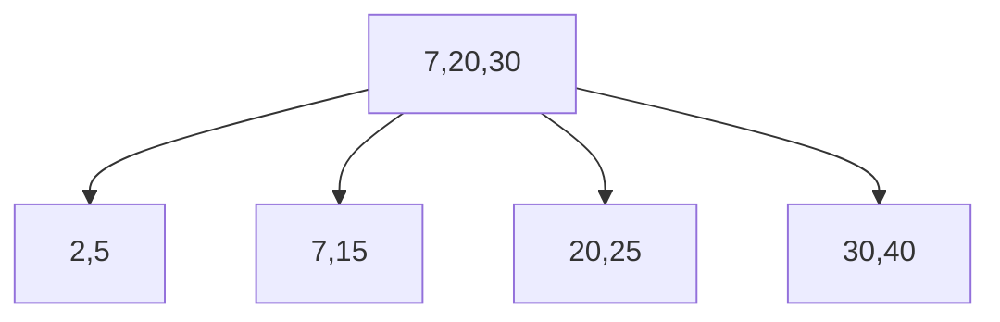

**Step**: Insert 29

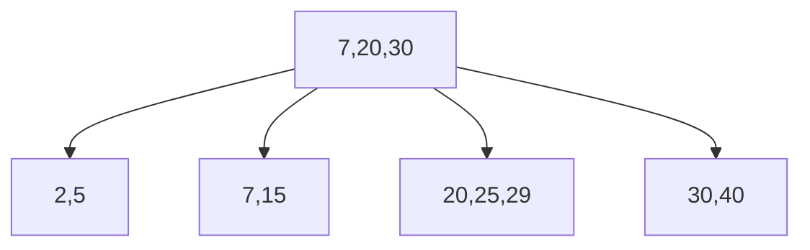

**Step**: Insert 23

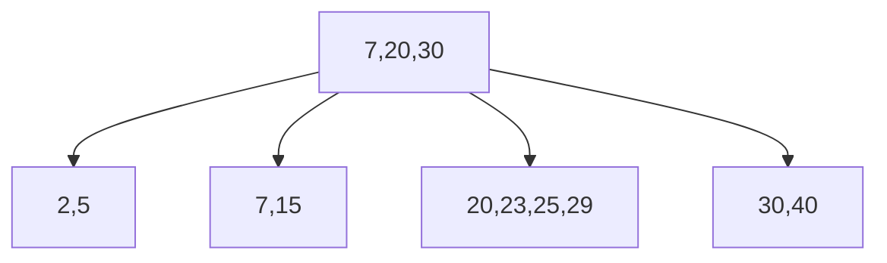

**Step**: After inserting 23, a vertex contains 4 keys and is overloaded, split it, and insert the smallest key on the right side into the parent.

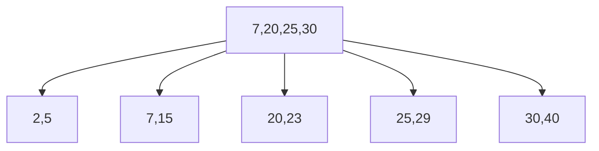

**Step**: After inserted 25 into the parent, the parent has 4 keys and is overloaded, split it, and move the smallest key on the right up one level.

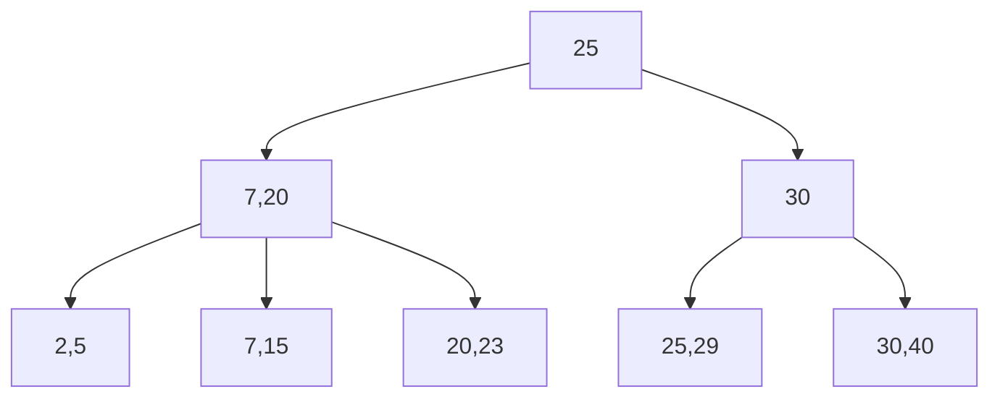

**Observation**: Note that if 25 is copied, doing so will result in the following tree:

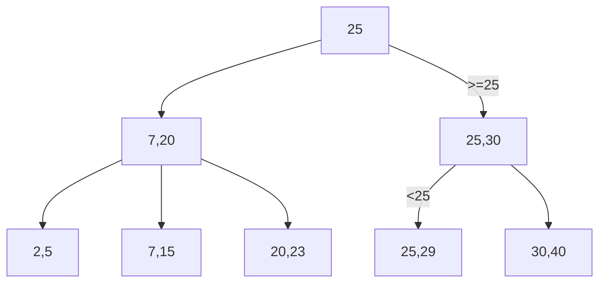

The tree violates B+ tree key property since 25 and 29 are not strictly smaller than 25.