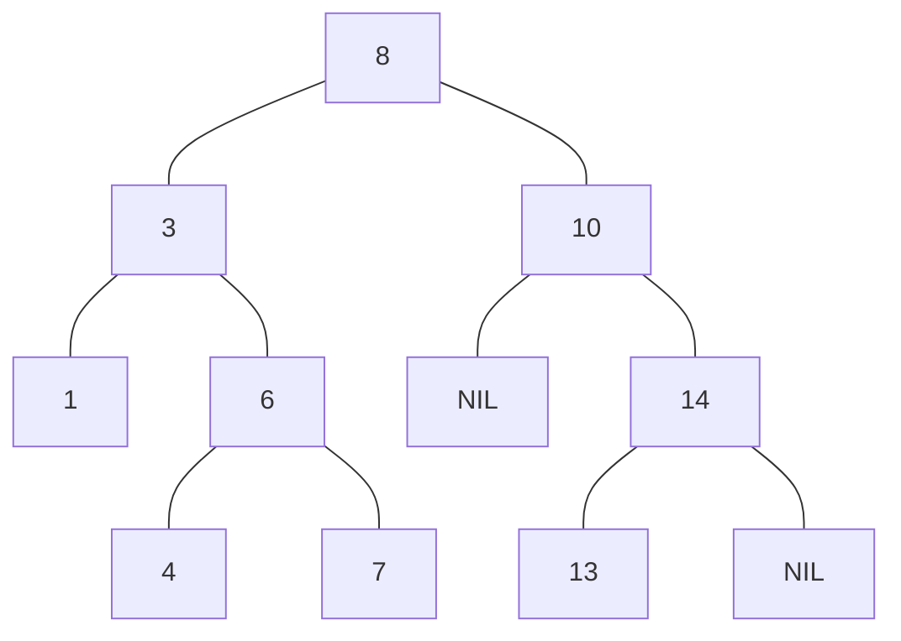

# Binary search tree

## Overview

**Definition**: A **binary search tree** is a rooted binary tree data structure which satisfy the **binary search tree property**. 

**Definition**: A binary tree is said to satisfy the **binary search tree property** if the key of each node is greater than every key on its left subtree and less than every key on its right subtree.

## Operations

### SEARCH 

**Definition**: The SEARCH operation looks for an arbitrary key in a binary search tree.

Searching begins by examining the root node. 
- If the tree is **NIL**, the key being searched for does not exist in the tree. 
- Otherwise, if the key equals that of the root, the search is successful and the node is returned. 
	- If the key is less than that of the root, the search proceeds by examining the left subtree.
	- If the key is greater than that of the root, the search proceeds by examining the right subtree. 
	
This process is repeated until the key is found or the remaining subtree is **NIL**. If the searched key is not found after a **NIL** subtree is reached, then the key is not present in the tree.

#### SUCCESSOR

**Definition**: The **SUCESSOR** operation is a specialized **SEARCH**. It looks for a the smallest key which is greater than a given node.

#### PREDECESSOR

**Definition**: The **PREDECESSOR** operation is a specialized **SEARCH**. It looks for a the greatest key which is smaller than a given node.

### INSERT 

**Definition**: The **INSERT** operation inserts an element as a leaf. The insertion is done in a way that maintains the binary search tree property.

### Delete 

**Definition**: The **DELETE** operation removes an arbitrary element from a BST and restore the BST property if necessary.

**Deleting a leaf**

If the node is a leaf node, then it is simply removed from the tree.

**Deleting a node with one child**

If the node has only one child, the child node is moved up to replace its parent.

**Deleting a node with two children**

To delete a node, say $A$, with two children from a BST, the successor of $A$, say $B$, is also considered.
- If $B$ is an immediate child of $A$, then $B$ is moved up to replace $A$.
- If $B$ is not an immediate child of $A$, the right child of $B$ is moved up to replace $B$, then $B$ is moved up to replace $A$.

In the second case, it is guarantee that $B$ only has one child on its right, since $B$ is a successor of $A$. In other words, $B$ is the smallest key which is greater than $A$.