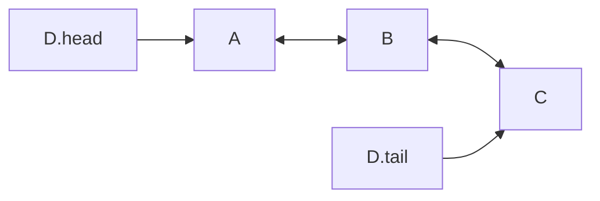

# Deque

**Definition**: A **Deque** is an ordered collection of elements. Elements of a deque can be added or removed from the front and the back.

Queues and stacks can be thought of as specialized deques.

## Queries and operations

### Queries

The queries have $O(1)$ time complexity.

**Definition**: The **HEAD** query returns the element at the head of deque without removing it.

**Definition**: The **TAIL** query returns the element at the tail of deque without removing it.

**Definition**: The **SIZE** query returns the number of elements in a deque.

**Definition**: The **EMPTY** query checks whether a deque has any element in it or not.

### Operations

The operations have $O(1)$ time complexity.

**Definition**: The **PUSH HEAD** operation inserts an element into the head of a deque. 

**Definition**: The **PUSH TAIL** operation inserts an element into the tail of a deque.

**Definition**: The **POP HEAD** operation removes an element from the head of a deque.

**Definition**: The **POP TAIL** operation removes an element from the tail of a deque.

