# Graph

**Definition**: A graph is an abstract data type that is meant to implement the **undirected graph** and **directed graph** concepts from the field of graph theory.

A graph data structure consists of a finite set of vertices, together with a set of unordered pairs of these vertices for an undirected graph or a set of ordered pairs for a directed graph. These pairs are known as edges.

**Definition**: A vertex $x$ said to be adjacent to a vertex $y$ if there exists an edge from $x$ to $y$.

## Graph representation

### Adjacency list

**Definition**: Each key in an **Adjacency list** represent a node in a graph, and the value is a collection of nodes in which the key is adjacent to.

In a graph with $m$ nodes and $n$ edges, an adjacency list takes up $O(m+n)$ space complexity.

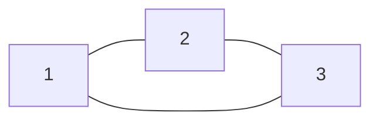

| Key | Value  |
| --- | ------ |
| 1   | <2, 3> |
| 2   | <1, 3> |
| 3   | <1, 2> |

### Adjacency matrix

**Definition**: In a row-major **adjacency matrix**, each row represents a node in a graph, and each entry in a row is marked with one if the row is adjacent to the column. Otherwise, it is marked with zero.

In a graph with $m$ nodes, an adjacency list takes up $O(m^{2})$ space complexity.

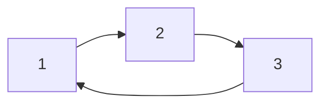

| Nodes | 1   | 2   | 3   |
| ----- | --- | --- | --- |
| 1     | 0   | 1   | 0   |
| 2     | 0   | 0   | 1   |
| 3     | 1   | 0   | 0   |

## Super-source

**Definition**: A super-source is a node in which it is adjacent to every other node, but no node is adjacent to it. As such, a super-source can only appear in directed graphs. If a super-source exists in a graph, it is unique.

## Graph traversal

### Breadth-first search

**Definition**: **Breadth-first search** is a graph traversal algorithm. It searches for a node with a particular property in a graph, and it can terminate early without exploring the entire graph.

It starts at the root and explores all nodes at the present depth prior to moving on to the nodes at the next depth level. 

A queue is needed to keep track of the child nodes that were encountered but not yet explored. 

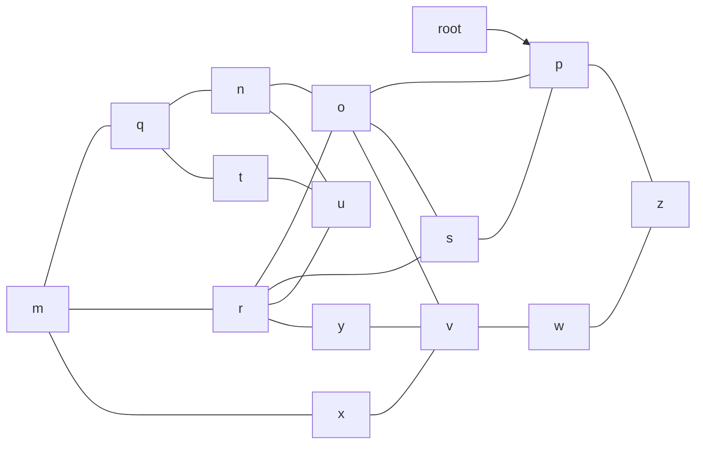

1. Enqueue "P":

| P   |
| --- |
|     |
	
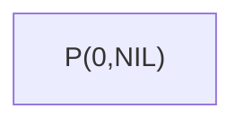

1. Dequeue "P" and enqueue "O, S, Z":

| O   | S   | Z   |
| --- | --- | --- |
|     |     |     |

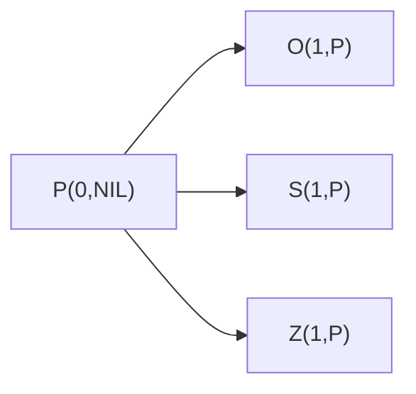

1. Dequeue "O" and enqueue "N, R, V":

| S   | Z   | N   | R   | V   |
| --- | --- | --- | --- | --- |
|     |     |     |     |     |

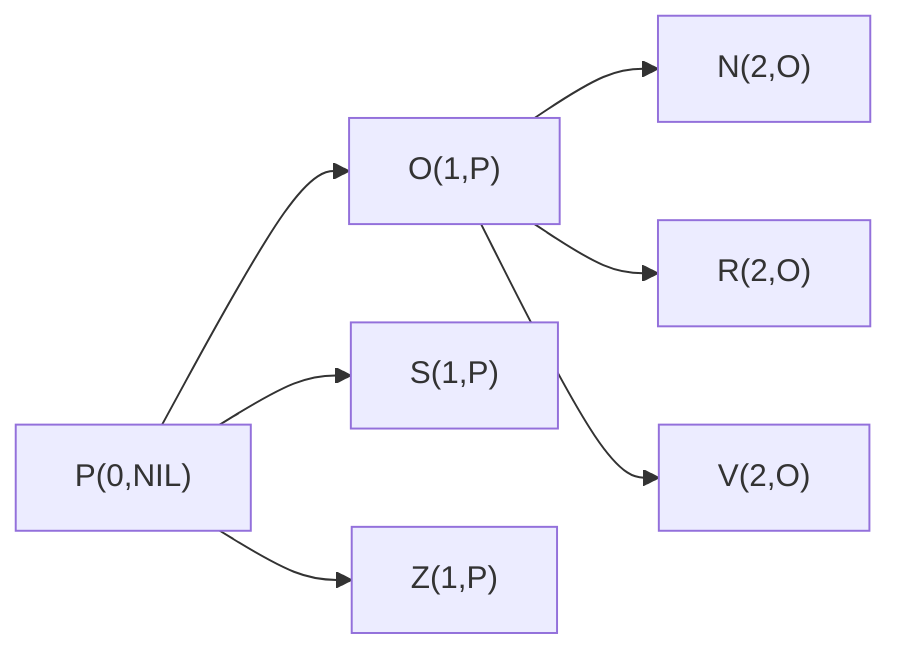

1. Dequeue "S" and enqueue nothing:

| Z   | N   | R   | V   |
| --- | --- | --- | --- |
|     |     |     |     |

1. Dequeue "Z" and enqueue "W":

| N   | R   | V   | W   |
| --- | --- | --- | --- |
|     |     |     |     |

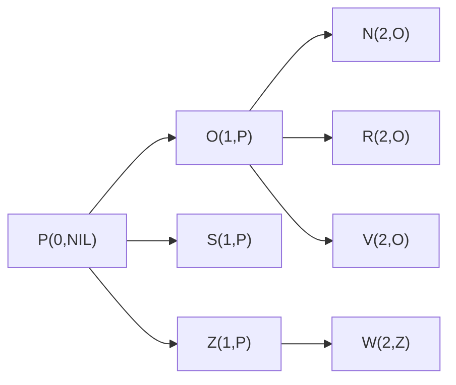

1. Dequeue "N" and enqueue "Q, U":

| R   | V   | W   | Q   | U   |
| --- | --- | --- | --- | --- |
|     |     |     |     |     |

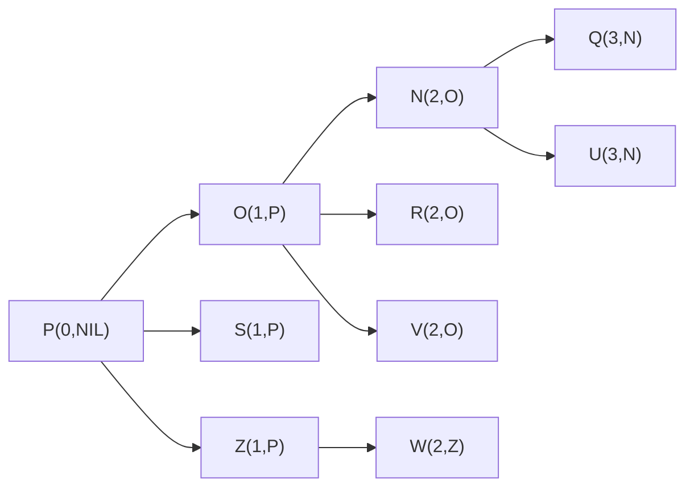

1. Dequeue "R" and enqueue "M, Y":

| V   | W   | Q   | U   | M   | Y   |
| --- | --- | --- | --- | --- | --- |
|     |     |     |     |     |     |

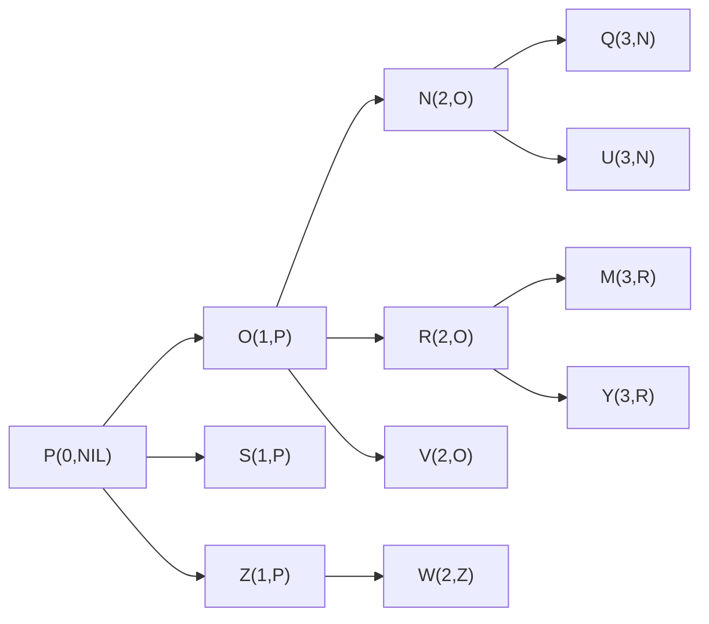

1. Dequeue "V" and enqueue "X":

| W   | Q   | U   | M   | Y   | X   |
| --- | --- | --- | --- | --- | --- |
|     |     |     |     |     |     |

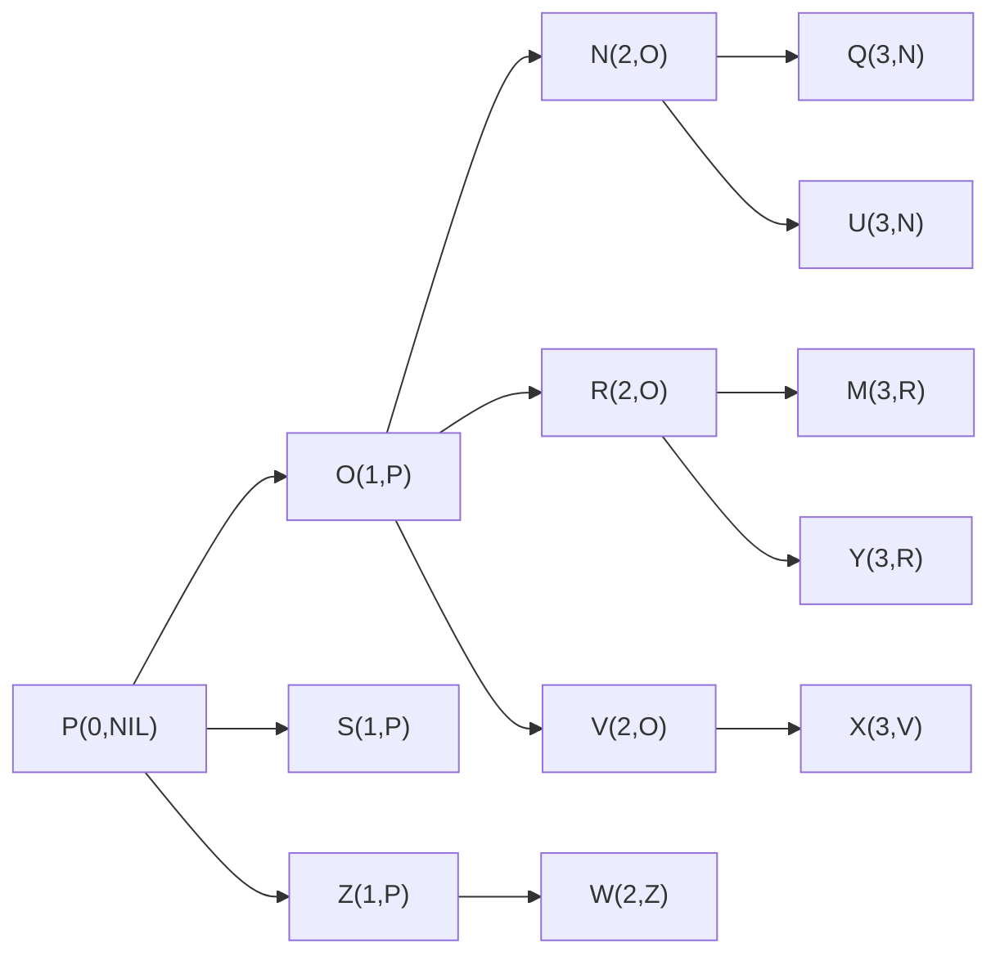

1. Dequeue "W" and enqueue nothing:

| Q   | U   | M   | Y   | X   |
| --- | --- | --- | --- | --- |
|     |     |     |     |     |

1. Dequeue "Q" and enqueue "T":

| U   | M   | Y   | X   | T   |
| --- | --- | --- | --- | --- |
|     |     |     |     |     |

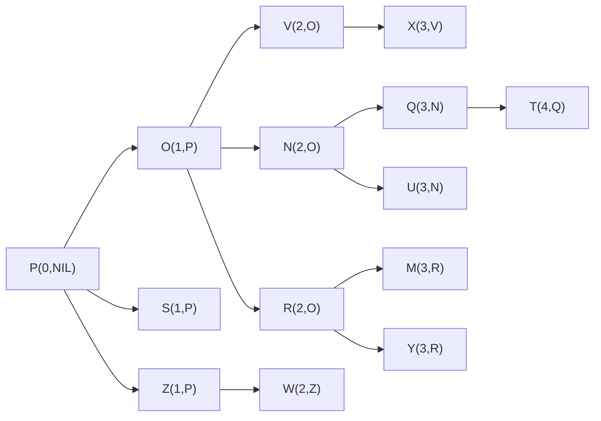

3. Dequeue "U" and enqueue nothing:

| M   | Y   | X   | T   |
| --- | --- | --- | --- |
|     |     |     |     |

1. Dequeue "M" and enqueue nothing:

| Y   | X   | T   |
| --- | --- | --- |
|     |     |     |

1. Dequeue "Y" and enqueue nothing:

| X   | T   |
| --- | --- |
|     |     |

1. Dequeue "X" and enqueue nothing:

| T   |
| --- |
|     |

1. Dequeue "T" and enqueue nothing:

| NIL |
| --- |
|     |

