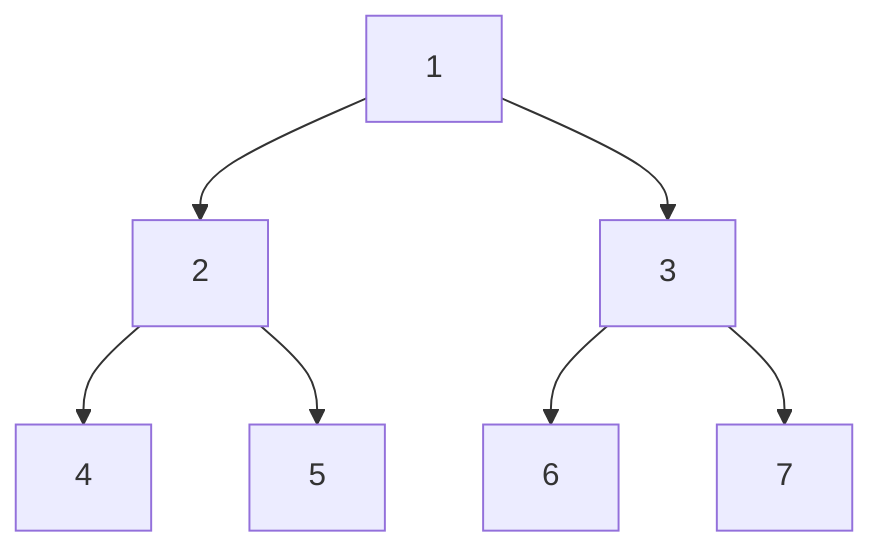
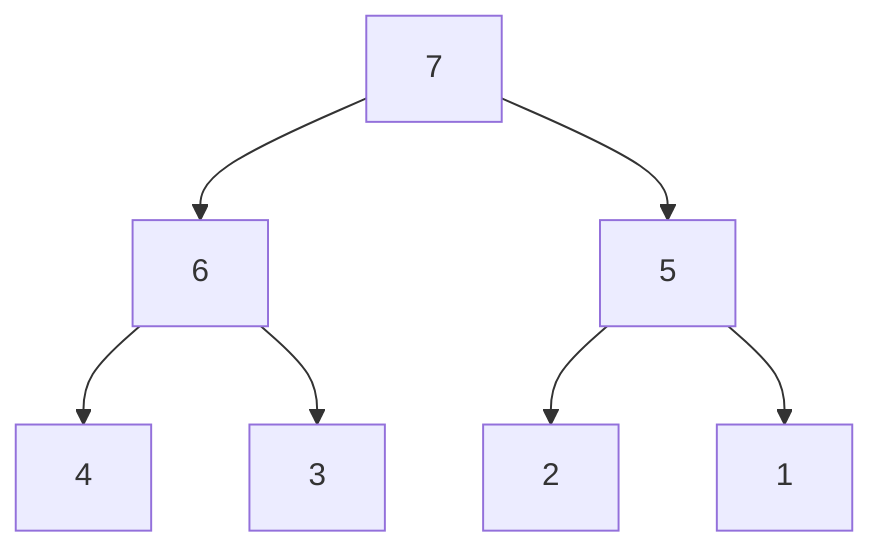
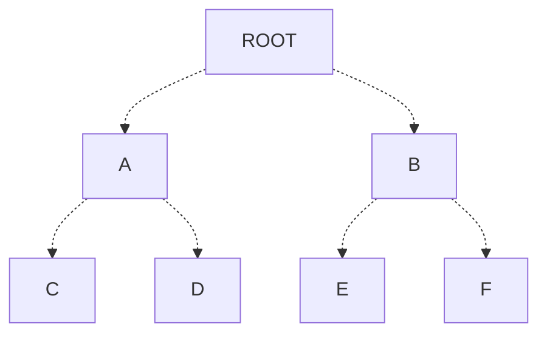
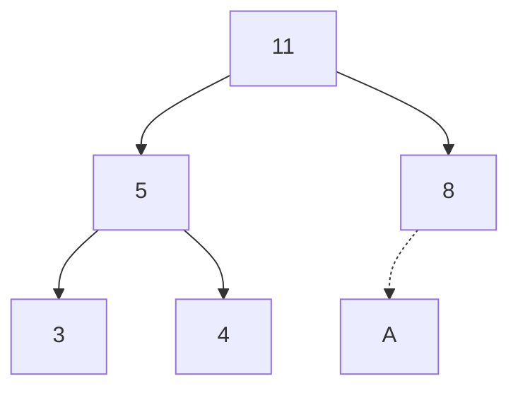
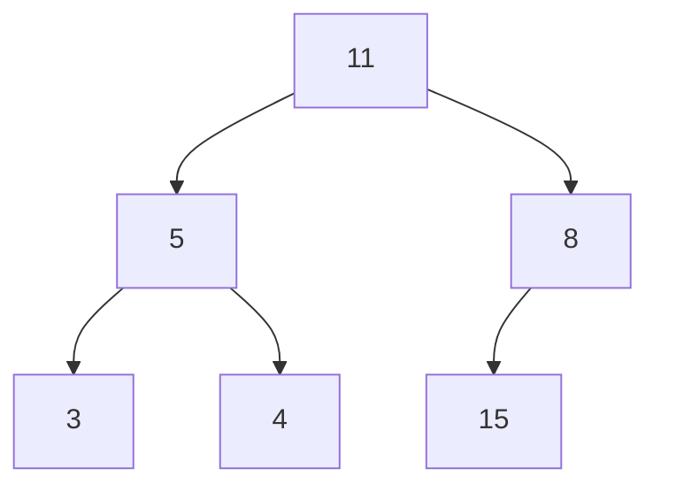
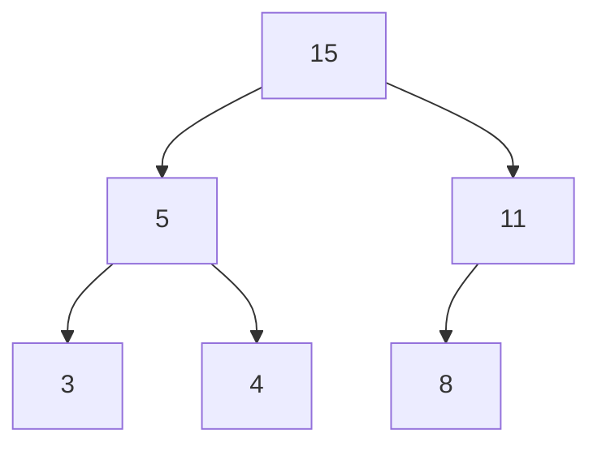
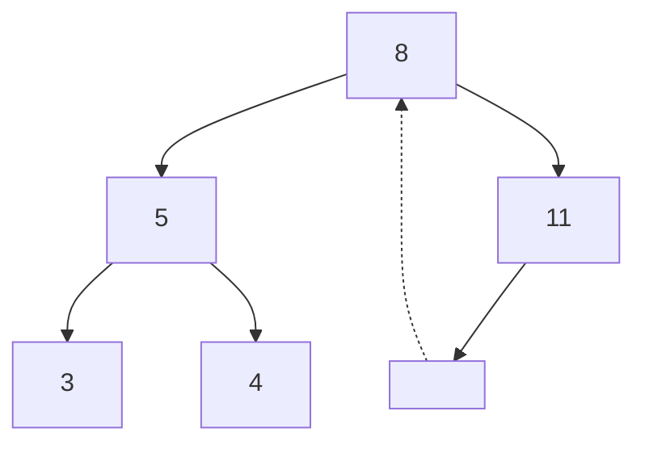
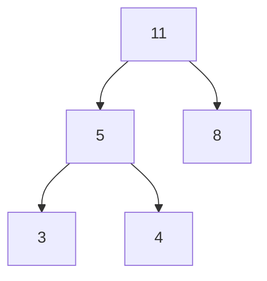

# Heap

**Definition**: A **heap** is a tree-based data structure that satisfies the one of the **heap** properties.

**Definition**: The node with no parent is called the **root**.

**Definition**: A node with no children is called a **leaf**.

**Definition**: $K$-ary heaps are heaps for which each node have $K$ children. A special term is given to $2$-ary heaps called **binary heap**.

**Definition**: A **min heap** is a heap which satisfy the **min heap property**; for every node $N$ and its parent $N_{P}$ the key of $N$ is greater than or equal to the key of $N_{P}$.

**Definition**: A **max heap** is a heap which satisfy the **max heap property**; for every node $N$ and its parent $N_{P}$ the key of $N$ is lesser than or equal to the key of $N_{P}$.

 
## Operations

There are two common operations on heaps: **INSERT** and **EXTRACT**.

**Definition**: The **SIFT UP** operation swaps a node, except the root, with its parent.

**Definition**: The **SIFT DOWN** operation swaps a node, except the leaves, with one of its children.

### INSERT operation

**Definition**: The **INSERT** operation inserts an element into a heap and restore the heap property if necessary.

The insert operation inserts elements onto a layer from left to right. Once a layer is full, a new element will be inserted on the left-most position of the next layer.

In the following empty binary heap, the first element inserted into the heap will replace "A", the second element will replace "B", and so on.

After insertion, it is possible that the heap property is violated. To verify and restore the heap property, the following steps are taken:

1. The key of the newly inserted element is compared against its parent if there is no violation, stop. 
2. Otherwise, swap the positions of new element and its parent and repeat the first step.

The process of inserting "15" into the following binary max heap goes as follows:

Inserted "15" into position "A":

The key of the newly inserted element is greater than its parent, their positions are swapped:

The key of the newly inserted element is still greater than its parent, their positions are swapped:

The max heap property is no longer violated.

### EXTRACT operation

**Definition**: The **EXTRACT** operation removes the root of a heap and maintain the heap property. 

The **EXTRACT** operation is a restricted form of removing elements as it only permits the removal of root, instead of an arbitrary element.

To maintain the heap property after extraction, the following steps are taken:

1. The root is replaced by the right-most element of the last layer.
2. If the heap property holds, stop.
3. Otherwise, swap the root with smallest child in min heap, and the largest child in max heap.

The process of extracting and restoring the heap property of a binary max heap goes as follows:

Extracted 15 and replace the root with the right-most element on the last layer:

The max heap property is violated, the positions of the root and its largest child are swapped:

The max heap property is no longer violated.

