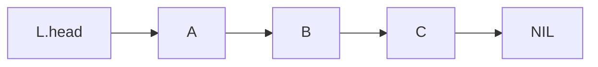

# Linear singly-linked list

## Overview

**Definition**: A **linear singly linked list** is an abstract data structure which implements a sequential collection.



**Definition**: Each element in an LSL contains two fields. The **data** field holds the satellite data, and the **next** filed holds the reference to the next node in the list.

```ts
type Element<T> = {
    data: T,
    next: Element<T>
}
```

## Operations

**Definition**: The **INSERT HEAD** operation inserts an element into the head of a linked list. **INSERT HEAD** has $O(1)$ time and space complexity.

**Definition**: The **INSERT AFTER** operation inserts an element into a linked list after the specified element. **INSERT AFTER** has $O(1)$ time and $O(1)$ space complexity.

**Definition**: The **INSERT TAIL** operation inserts an element into the tail of a linked list. **INSERT TAIL** has $O(n)$ time and $O(1)$ space complexity, but the time complexity can be reduced to $O(1)$ by storing the reference of the tail element.

**Definition**: The **REMOVE** operation removes an element from a linked list. An element can be removed from one of three positions; from the head, from between two elements, and from the tail.
