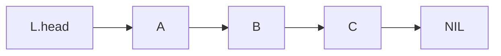

# Linear singly-linked list

## Overview

**Definition**: A **linear singly linked list** is an abstract data structure which implements a sequential collection.



**Definition**: Each element in an LSL contains two fields. The **data** field holds the satellite data, and the **next** filed holds the reference to the next node in the list.

```ts
type Element<T> = {
    data: T,
    next: Element<T>
}
```

## Operations

**Definition**: The **INSERT** operation inserts an element into a linked list. An element can be inserted in one of three positions; at the head, between two elements, and at the tail.

**Definition**: The **REMOVE** operation removes an element from a linked list. An element can be removed from one of three positions; from the head, from between two elements, and from the tail.
