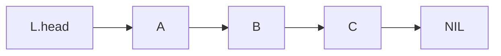
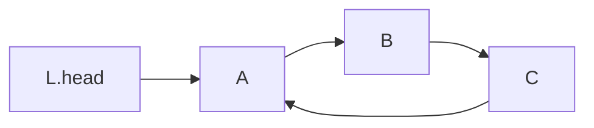
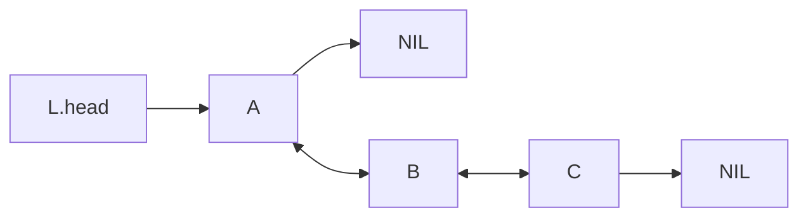
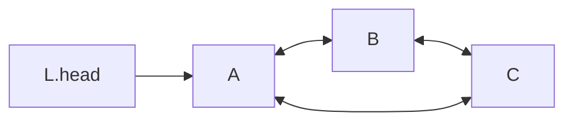

# Linked list

**Definition**: A **linear singly linked list** is an ordered collection of element and each element has a reference to the next element.

**Definition**: A **circular singly linked list** is a singly linked list whose last element references the first element instead of NIL.

**Definition**: A **linear doubly linked list** is collection of ordered elements. Each element contains references to the previous and the next element.

**Definition**: A **circular doubly linked list** is a linear doubly linked list whose elements form a closed loop.

**Definition**: A **sentinel element** does not have a reference to the next element.

## Queries and operations

### Queries

**Definition**: **INDEX** query returns arbitrary element from a linked list. The time  complexity is $O(n)$ where $n$ is the number of elements in the linked list. The space complexity is $O(1)$.

### Operations

**Definition**: The **INSERT** operation inserts an element into a linked list. An element can be inserted in one of three positions; at the head, between two elements, and at the tail.

**Definition**: The **REMOVE** operation removes an element from a linked list. Similar to **INSERT**, an element can be removed from one of three positions; from the head, from between two elements, from the tail. Removing the head of an empty LSL causes it to **underflow**.
