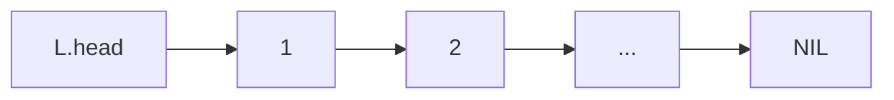
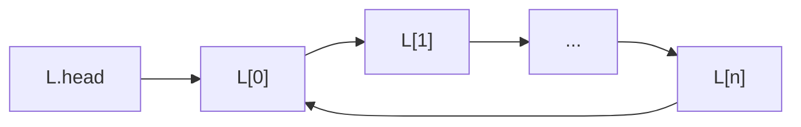
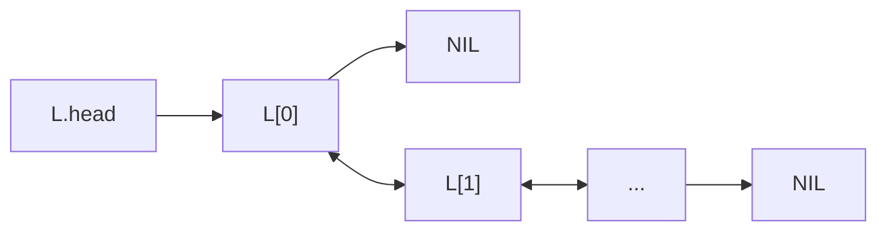
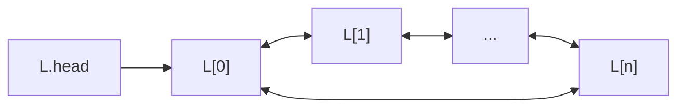

# Linked list

**Definition**: In a linear linked list, a **sentinel element** is an element which does not have a reference to the next element.

## Linear singly linked list

**Definition**: A **linear singly linked list** is an ordered collection of element and each element has a reference to the next element.

For the sake of brevity, the term "linear singly linked" list will be shortened to "LSL".



### Common operations

There are four common operations on LSL:
**INSERT AFTER**, **INSERT HEAD**, **REMOVE AFTER**, and **REMOVE HEAD**.

#### INSERT HEAD operation

**Definition**: The **INSERT HEAD** operation inserts an element at the head of an LSL. 

**EMPTY LSL**

Consider an empty LSL, inserting an element "A" to its head:

0. Initial LSL

	```mermaid
	flowchart LR
		L.head-->NIL
	```

1. Prepare to insert "A":

	```mermaid
	flowchart LR
		L.head-->NIL
		L.head-.->A-.->NIL
	```

2. Inserted "A":

	```mermaid
	flowchart LR
		L.head-->A-->NIL
	```

**Non-empty LSL**

Consider a non-empty LSL, inserting an element "A" to its head:

0. Initial LSL:

	```mermaid
	flowchart LR
		L.head-->B-->C[...]-->NIL
	```

1. Prepare to insert "A":

	```mermaid
	flowchart LR
		L.head-->B-->C[...]-->NIL
		L.head-.->A-.->B
	```

1. Inserted "A":

	```mermaid
	flowchart LR
		L.head-->A-->B-->C[...]-->NIL
	```

#### INSERT AFTER operation

**Definition**: The **INSERT AFTER** operation inserts an element into an LSL after a particular element, so this operation does not work on empty LSL.

Consider an non-empty LSL, insert an element "A" after the element "N":

0. Initial LSL:

	```mermaid
	flowchart LR
		L.head-->1[...]-->N-->2[...]-->NIL
	```

1. Prepare to insert "A":

	```mermaid
	flowchart LR
		L.head-->1[...]-->N-->2[...]-->NIL
		N-.->A-.->2
	```

1. Inserted "A":

	```mermaid
	flowchart LR
		L.head-->1[...]-->N-->A-->2[...]-->NIL
	```

#### REMOVE HEAD operation

**Definition**: The **REMVOE HEAD** operation removes the first element from an LSL. Removing the head of an empty LSL causes it to **underflow**.

Consider a non-empty LSL, remove the first element from it:

0. Initial LSL:

	```mermaid
	flowchart LR
		L.head-->A-->B-->C[...]-->NIL
	```

1. Prepare to remove "A":

	```mermaid
	flowchart LR
		L.head-->A-->B-->C[...]-->NIL
		L.head-.->B
	```

1. Removed "A":

	```mermaid
	flowchart LR
		L.head-->B-->C[...]-->NIL
	```


## Circular singly linked list

**Definition**: A **circular singly linked list** is a singly linked list whose last element element references the first element instead of NIL.



## Linear doubly linked list

**Definition**: A **linear doubly linked list** is collection of ordered elements. Each element contains references to the previous and the next element.



## Circular doubly linked list

**Definition**: A **circular doubly linked list** is a linear doubly linked list whose elements form a closed loop.


