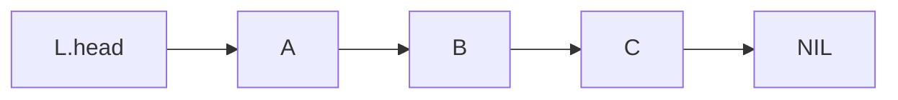
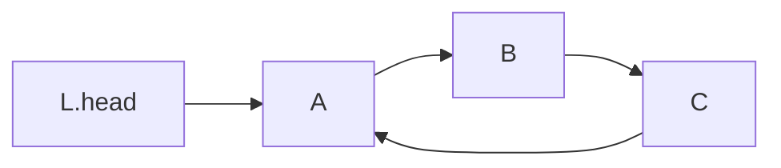
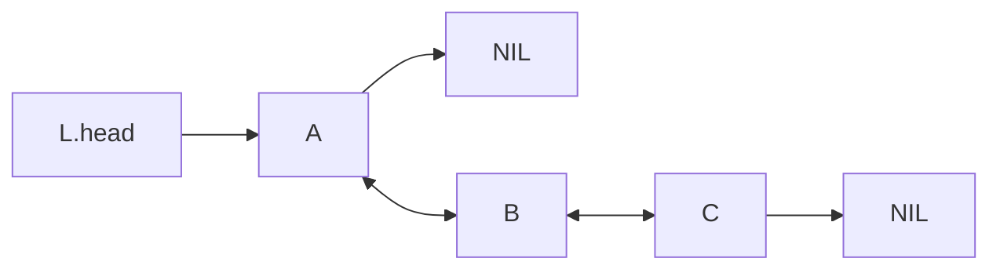
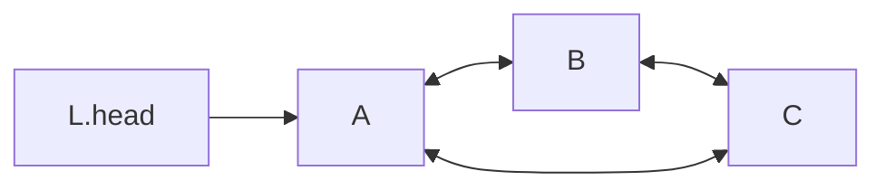

# Linked list

**Definition**: In a linear linked list, a **sentinel element** is an element which does not have a reference to the next element.

## Common operations

There are two common operations which are shared amongst all variants of linked list: **INSERT** and **REMOVE**.

An element can be inserted and removed from three positions; at the head, between elements, and at the tail.

### INSERT operation

**Definition**: The **INSERT** operation inserts an element into a linked list. 

### REMOVE operation

**Definition**: The **REMVOE HEAD** operation removes an element from a linked list. Removing the head of an empty LSL causes it to **underflow**.

## Variants

### Linear singly linked list

**Definition**: A **linear singly linked list** is an ordered collection of element and each element has a reference to the next element.

### Circular singly linked list

**Definition**: A **circular singly linked list** is a singly linked list whose last element references the first element instead of NIL.

### Linear doubly linked list

**Definition**: A **linear doubly linked list** is collection of ordered elements. Each element contains references to the previous and the next element.

### Circular doubly linked list

**Definition**: A **circular doubly linked list** is a linear doubly linked list whose elements form a closed loop.

