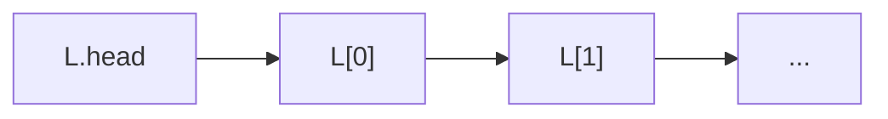
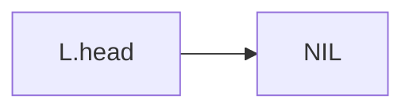
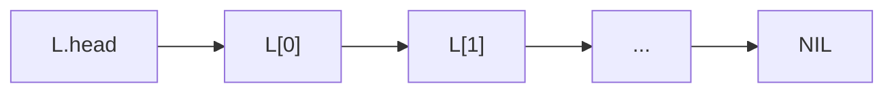
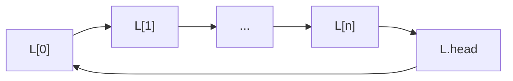

# Linked list

**Definition**: A **linked list** or **singly-linked list** is a linear and ordered collection of elements. Unlike an array, the order of elements is not determined by memory location, instead, each element has a reference to next the next element.

Visually, a linked list is the head of a serially linked elements and each element contains some satellite data along with a reference to the next element.

**Definition**: An linked list $L$ is said to be **empty** if $L.head$ is $NIL$ or other forms of null value.

**Definition**: A **sentinel element** marks the end of a linked list so it does not contain a reference to the next element.

## Operations

Elements are inserted and deleted efficiently in a linked list. However, elements are serially-linked, so to access a particular element, it is required to access the prior node.

## Circular linked list

**Definition**: A circular linked list is a linked list whose last element element references the first element instead of NIL or other forms of null value.

