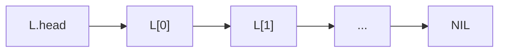
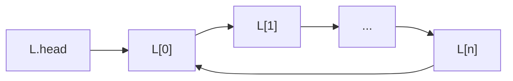
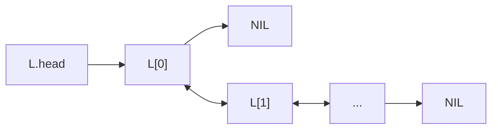
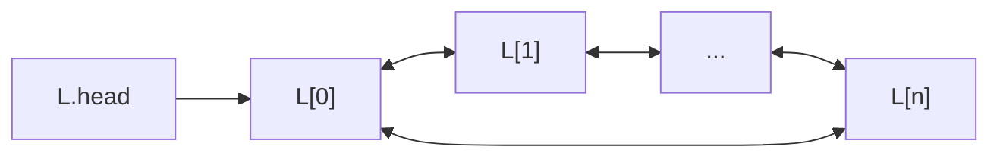
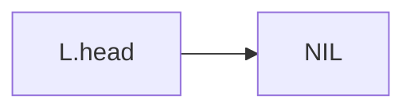

# Linked list

**Definition**: A **linear singly linked list** is an ordered collection of element and each element has a reference to the next element.

Visually, a singly linked list is the head of a serially linked elements and each element contains some satellite data along with a reference to the next element.

**Definition**: A **circular singly linked list** is a singly linked list whose last element element references the first element instead of NIL.

**Definition**: A **linear doubly linked list** is collection of ordered elements. Each element contains references to the previous and the next element.

**Definition**: A **circular doubly linked list** is a linear doubly linked list whose elements form a closed loop.

**Definition**: An linked list $L$ is said to be **empty** if $L.head$ is $NIL$ or other forms of null value.

**Definition**: A **sentinel element** marks the end of a linked list so it does not contain a reference to the next element.

## Common operations

Elements are inserted and deleted efficiently in a linked list. However, elements are serially-linked, so to access a particular element, it is required to access the prior node.

