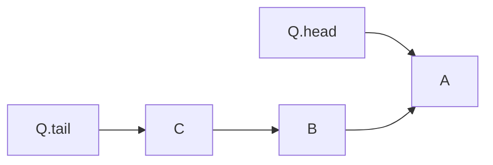

# Queue

## Overview

**Definition**: A **queue** is an abstract data structure which implements a sequential collection. Elements are removed from a queue in the same order in which they are inserted.

## Operations

There are two common operations on a queue: **ENQUEUE** and **DEQUEUE**. The operations have $O(1)$ time complexity and $O(1)$ space complexity.

**Definition**: The **ENQUEUE** operation adds an element to the end of the queue. **ENQUEUE** has $O(1)$ time and space complexity.

**Definition**: The **DEQUEUE** operation removes the element from the head of a queue. **DEQUEUE** has $O(1)$ time and space complexities.

