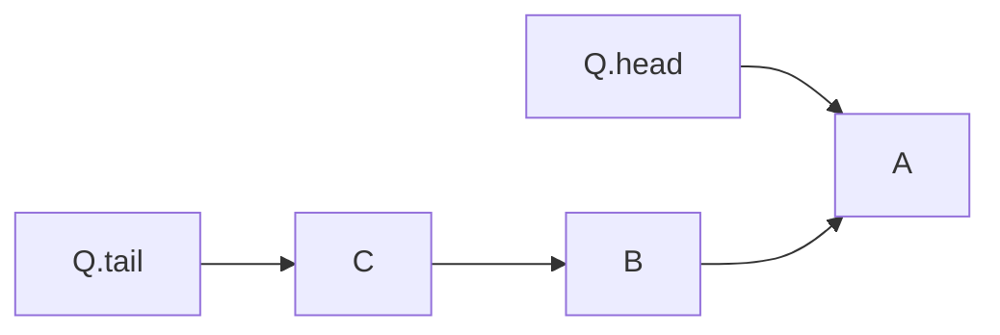
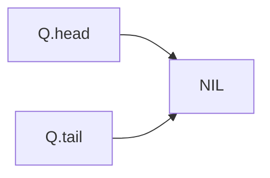

# Queue

**Definition**: A **Queue** is an ordered collection of elements. Elements in a queue are removed in the same order in which they are inserted, called **first-in-first-out**.



## Common operations

There are two common operations on a queue: **ENQUEUE** and **DEQUEUE**.

**Theorem**: The time complexity of **ENQUEUE** and **DEQUEUE** operations is $O(1)$.

**Theorem**: Indexing an element in a queue has $O(n)$ where $n$ is the size of the queue.

**Theorem**: The space complexities of a queue is $\Theta(n)$ are $O(n)$, where $n$ is the number of elements in a queue.

### ENQUENE operation

**Definition**: The **ENQUEUE** operation adds an element to the end of the queue.

**Example**: Enqueue three elements into an empty queue.



1. Prepare to enqueue "A"

	```mermaid
	flowchart LR
		Q.head & Q.tail--xNIL
		Q.head & Q.tail-.->A
		
	```

1. Enqueued "A"

	```mermaid
	flowchart LR
		Q.head & Q.tail -->A
	```

1. Prepare to enqueue "B"

	```mermaid
	flowchart LR
		Q.head-->A
		Q.tail-.->B-.->A
		Q.tail--xA
	```

1. Enqueued "B"

	```mermaid
	flowchart LR
		Q.head-->A
		Q.tail-->B-->A
	```

1. Prepare to enqueue "C"

	```mermaid
	flowchart LR
		Q.head-->A
		Q.tail-.->C-.->B
		Q.tail--xB-->A
	```

1. Enqueued "C"

	```mermaid
	flowchart LR
		Q.head-->A
		Q.tail-->C-->B-->A
	```

### DEQUEUE operation

**Definition**: The **DEQUEUE** operation removes the element at the head of a queue.

**Example**: Dequeue three elements into a queue.


1. Prepare to dequeue "A"

	```mermaid
	flowchart LR
		Q.head--xA
		Q.tail-->C-->B-->A
		Q.head-.->B
	```

1. Dequeued "A"

	```mermaid
	flowchart LR
		Q.head-->B
		Q.tail-->C-->B
	```

1. Prepare to dequeue "B"

	```mermaid
	flowchart LR
		Q.head--xB
		Q.tail-->C-->B
		Q.head-.->C
	```

1. Dequeued "B"

	```mermaid
	flowchart LR
		Q.head & Q.tail -->C
	```

1. Prepare to dequeue "C"

	```mermaid
	flowchart LR
		Q.head & Q.tail--xC
		Q.head & Q.tail-.-> NIL
	```

1. Dequeued "C"

	```mermaid
	flowchart LR
		Q.head & Q.tail-->NIL
	```