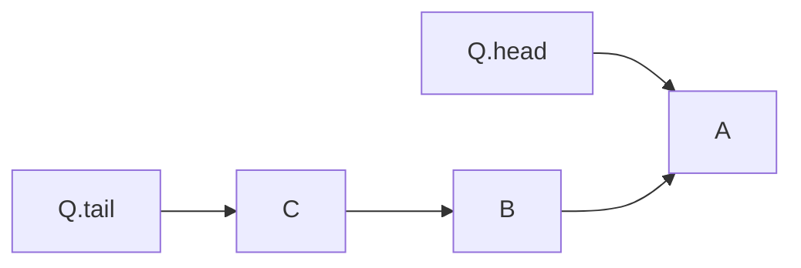

# Queue

**Definition**: A **Queue** is an ordered collection of elements. Elements in a queue are removed in the same order in which they are inserted, called **first-in-first-out**.

## Queries and operations

### Queries

There are four common queries on a queue: **HEAD**, **TAIL**, **SIZE**, **EMPTY**. The queries have $O(1)$ time complexity and $O(1)$ space complexity.

**Definition**: The **HEAD** query returns the element at the head of a queue without removing it.

**Definition**: The **TAIL** query returns the element at the tail of a queue without removing it.

**Definition**: The **SIZE** query returns the number elements in the queue.

**Definition**: The **EMPTY** query checks whether a queue contains any element or not.

### Operations

There are two common operations on a queue: **ENQUEUE** and **DEQUEUE**. The operations have $O(1)$ time complexity and $O(1)$ space complexity.

**Definition**: The **ENQUEUE** operation adds an element to the end of the queue.

**Definition**: The **DEQUEUE** operation removes the element at the head of a queue.

