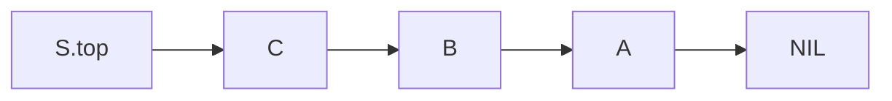

# Stack

**Definition**: A **stack** is an ordered collection of elements. Elements of a stack are removed in the reserved order in which they are inserted, called **last-in-first-out**.

## Queries and operations

### Queries

There are three common queries on a stack: **SIZE**, **PEEK**, and **EMPTY**. The queries have $O(1)$ time complexity and $O(1)$ space complexity.

**Definition**: The **SIZE** query returns the number of elements in the stack.

**Definition**: The **PEEK** query returns the top-most element of a stack without removing it.

**Definition**: The **EMPTY** query checks whether a stack contains any element or not.

### Operations

There are two common operations on a stack: **PUSH** and **POP**. Both operations have $O(1)$ time complexity and $O(1)$ space complexity.

**Definition**: The **PUSH** operation adds an element onto the top of the stack. **Pushing** an element onto a full stack results in an error called **stack overflow**.

**Definition**: The **POP** operation removes the top-most element from the stack. **Popping** an element from an empty stack results in an error called **stack underflow**.

