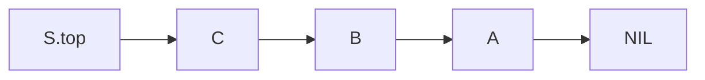

# Stack

## Overview

**Definition**: A **stack** is an abstract data structure which implements a sequential collection. Elements are removed from a stack in the reserved order in which they are added.

## Operations

**Definition**: The **PUSH** operation adds an element onto the top of the stack. **PUSH** has $O(1)$ time and space complexity.

**Definition**: The **POP** operation removes the most recently added element. **POP** has $O(1)$ time and space complexity.

**Definition**: Pushing an element onto a full stack results in a **stack overflow** error.

**Definition**: Popping an element from an empty stack results in a **stack underflow** error.

