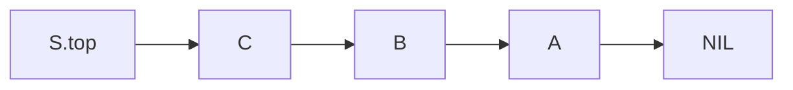
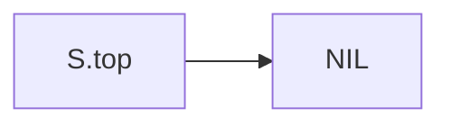

# Stack

**Definition**: A **stack** is an ordered collection of elements. Elements of a stack are removed in the reserved order in which they are inserted, called **last-in-first-out**.




## Operations

### PUSH operation

**Definition**: The **PUSH** operation adds an element onto the top of the stack. **Pushing** an element onto a full stack results in an error called **stack overflow**.

**Example**: Push three elements onto an empty stack.



1. Prepare to push "A"

	```mermaid
	flowchart LR
	S.top-.->A-.->NIL
	S.top--xNIL
	```

1. Pushed "A"

	```mermaid
	flowchart LR
		S.top-->A-->NIL
	```

1. Prepare to push "B"

	```mermaid
	flowchart LR
		S.top-.->B-.->A
		S.top--xA-->NIL
	```

1. Pushed "B"

	```mermaid
	flowchart LR
		S.top-->B-->A-->NIL
	```

1. Prepare to push "C"

	```mermaid
	flowchart LR
		S.top-.->C-.->B
		S.top--xB-->A-->NIL
	```

1. Pushed "C":

	```mermaid
	flowchart LR
		S.top-->C-->B-->A-->NIL
	```

### POP operation

**Definition**: The **POP** operation removes the top-most element from the stack. **Popping** an element from an empty stack results in an error called **stack underflow**.

**Example**: Popping three elements from a stack.


1. Prepare to pop "C"

	```mermaid
	flowchart LR
		S.top-.->B
		S.top--xC--xB-->A-->NIL
	```

2. Popped "C"

	```mermaid
	flowchart LR
		S.top-->B-->A-->NIL
	```

3. Prepare to pop "B"

	```mermaid
	flowchart LR
		S.top-.->A
		S.top--xB--xA-->NIL
	```

4. Popped "B"

	```mermaid
	flowchart LR
		S.top-->A-->NIL
	```

5. Prepare to pop "A"

	```mermaid
	flowchart LR
		S.top-.->NIL
		S.top--xA--xNIL
	```

6. Popped "A":

	```mermaid
	flowchart LR
	S.top-->NIL
	```
