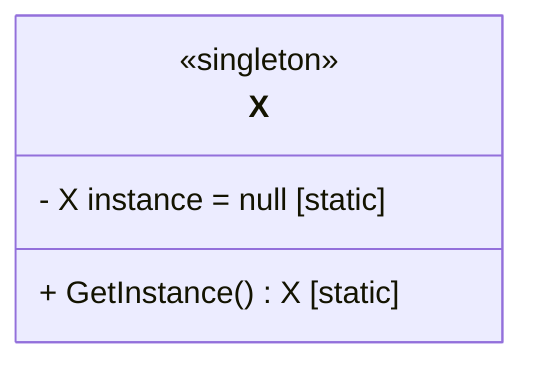

# Singleton design pattern

## Intention

**Singleton design pattern** is a creational design pattern that lets you ensure that a class has only one instance, while providing a global access point to this instance.

This pattern is useful when there is no benefit to have multiple instances of a class, so we can keep reusing one instance throughout the life cycle of our program.

## Practical example

Let's say we a utility classes which provide multiple formatter methods. We will say that those methods are not static for the sake of demonstration.

```python
class Utility:
	def formatInt(...)
	def formatFloat(...)
	def formatBool(...)
```

We can have many instances of the *Utility*, but there is no distinction between one instance and another. In fact, every instance  of *Utility* behave in the same way, and if we have more than one instance, we are wasting precious memory with unnecessary instantiations.

## Structure

The structure of a singleton class consists of three major components; a private constructor, a class-level variable *instance* to keep track of the instance, and a public method *GetInstance* to instantiate or access the sole instance of the class.



The method *GetInstance* initializes an object or return the instance if it exists.