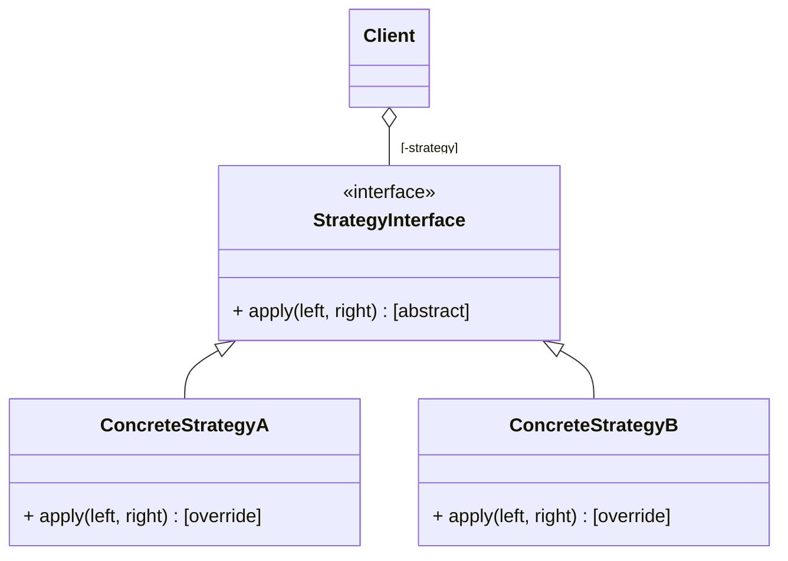

# Strategy design pattern

## Intention

**Strategy design pattern** is a behavioral design pattern that lets you define a family of algorithms, put each of them into a separate class, and make their objects interchangeable.

## Practical example

Let's say we have implemented a simple expression evaluator. It is implemented in a simple way for the sake of demonstration;

```python
class Evaluator:
	def compute(left: int, right: int, op: string) -> int:
		match op:
			case "+": return left + right
			case "-": return left - right
```

This class works well for a time, but eventually, we have to add more operations. As a result, the class has became difficult to maintain. More specifically, *compute* has became too large, it has too many responsibility. It has too decide with operation to perform base on the given *op* and it has to execute the actual calculation also.

```python
class Evaluator:
	def __init__(self, op: str):
		this.op = op
	def compute(self, left: int, right: int):
		match self.op:
			case "+": return left + right
			case "-": return left - right
			case "/": ...
			case "*": ...
			case "^": ...
			case "//": ...
```

In this scenario, we will reduce the size of *compute* by applying strategy design pattern. We want to refactor *compute* in such a way that its sole responsibility is computing.

We will define an abstract base class with one method *apply*. The method will take two arguments and return a result.

```python
class Operation(ABC):
	@abstractmethod
	def apply(self, left: T, right: K) -> V
```

From this base class, we will define the common operations on integers. For the sake of brevity, let's only write the first few classes.

```python
class IntAdd(Operation):
	def apply(self, left: int, right: int):
		...
		
class IntSub(Operation):
	def apply(self, left: int, right: int):
		...
```

Lastly, we need to refactor *compute* itself to accommodate this pattern. Instead of giving *op*, will pass a concrete instance of *Operation* and *compute* can simply invoke *apply* on the given arguments;

```python
class Evaluator:
	def __init__(self, op: Operation):
		self.op = op
		
	def compute(self, left: int, right: int):
		 return op.apply(left, right)
```

## Structure

We refer to *Operation* as the strategy interface, *IntAdd* and *IntSub* as strategies, and *Evaluator* as the client. The strategies implement the strategy interface and the client aggregates a reference to the strategy interface.

