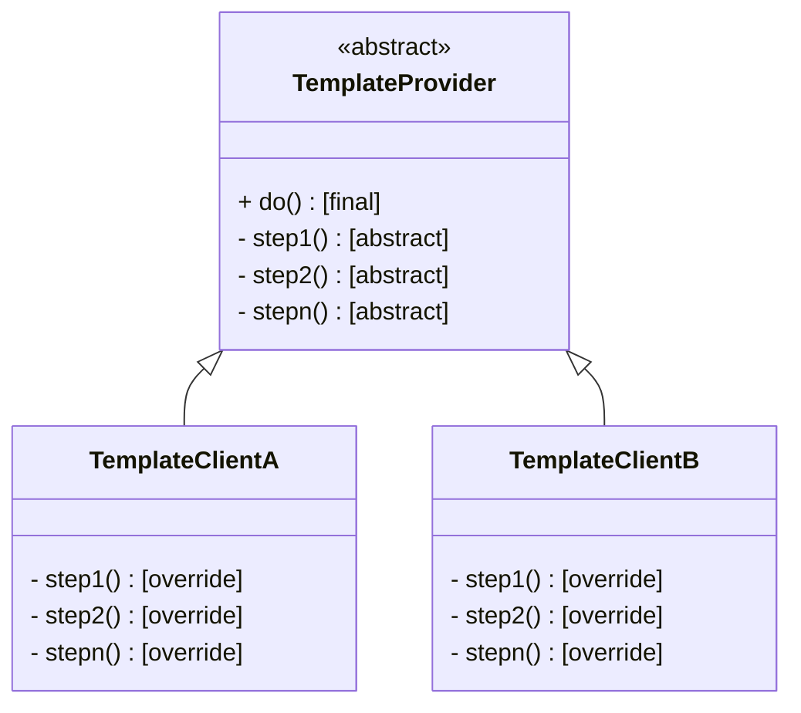

# Template method design pattern

## Intention

**Template Method** is a behavioral design pattern that defines the skeleton of an algorithm in the superclass but lets subclasses override specific steps of the algorithm without changing its structure.

The clients can modify each and every step in the algorithm of our program, but cannot modify the order of operations.

## Practical example

Let's say we have written a JPG decoder. The actual implementation itself does not matter too much, only the general steps in the algorithm.

```python
class JPGDecoder:
	def decode(self, fileName: str):
		f = open(fileName)
		p = self.parseJPG(file)
		return self.formatJPG(p)
	
	def parseJPG(self, file: File):
		...
	
	def formatJPG(self, string: str):
		...
```

This class works well, so we begin implementing decoders for other image format; namely, PNG and WEBP.

```python
class PNGDecoder:
	def decode(self, fileName: str):
		f = open(fileName)
		p = self.parsePNG(file)
		return self.formatPNG(p)
	
	def parsePNG(self, file: File):
		...
	
	def formatPNG(self, string: str):
		...

class WebPDecoder:
	def decode(self, fileName: str):
		f = open(fileName)
		p = self.parsePNG(file)
		return self.formatWebP(p)
	
	def parseWebP(self, file: File):
		...
	
	def formatWebP(self, string: str):
		...
```

It is at this point that we start to see the issue of code duplication. We notice that the *decode* method of the three classes are almost exactly the same. In this scenario, we can apply the template method design pattern.

We start by writing an abstract base class, and the decoders will inherit from it;

```python
class Decoder(ABC):
	def decode(self, fileName: str):
		f = open(fileName)
		p = self.parse(file)
		return self.format(p)
	
	@abstractmethod
	def parse(self, file: File)
	
	@abstractmethod
	def format(self, string: str)
```

Then, we need to refactor the decoders to inherit from this base class. However, we only need to override *parse* and *format* since *decode* remains the same structure-wise throughout each implementation.

```python
class JPGDecoder(Decoder):
	def parse(self, file: File):
		...
	
	def format(self, string: str):
		...


class PNGDecoder(Decoder):
	def parse(self, file: File):
		...
	
	def format(self, string: str):
		...

class WebPDecoder(Decoder):
	def parse(self, file: File):
		...
	
	def format(self, string: str):
		...
```

We have successfully removed code duplication while still following the open-closed principle. If we want to implement a new decoder, we simply have to extend *Decode* class.

## Structure

This is one such example of the template method design pattern. In out case, *decode* is the template method. A template method will not be override in the subclass.

```python
class TemplateProvider(ABC):
	def do(self):
		self.step1()
		self.step2()
		self.stepn()
	
	@abstractmethod
	def step1(self)
	
	@abstractmethod
	def step2(self)
	
	@abstractmethod
	def stepn(self)
```

The clients can override each step in *do*, but they do not have control over the order of execution. We can classify steps in the template method into two categories; abstract steps and optional steps, where abstract steps must be implement in the subclasses, while optional steps have some default implementation. 

Of course, if every step of *TemplateProvider* has a default implementation, it is not necessary to make the class abstract.

