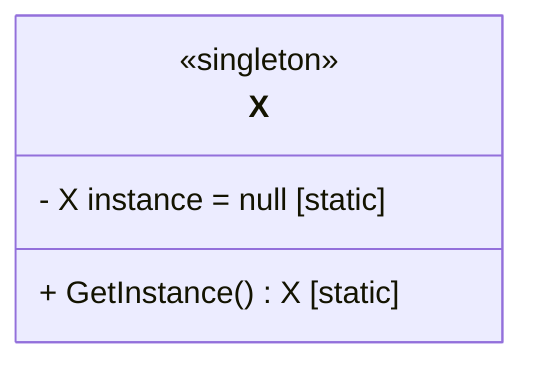

# Visitor design pattern

## Intention

**Visitor design pattern*** is a behavioral design pattern. It it useful in cases when we want to extend the functionalities a class, but we do not want to modify the underlying class.

Essentially, we create a additional class which we will call *Visitor*. As the name suggest, the purpose of this class is to *visit* the underlying class or classes.

## Structure

The structure of a singleton class consists of three major components; a private constructor, a class-level variable *instance* to keep track of the instance, and a public method *GetInstance* to instantiate or access the sole instance of the class.

The method *GetInstance* initializes an object or return the instance if it exists.