# Class diagrams

*Class diagrams* provide a visual representation to the ways classes interact in a program. One important distinction to make is that class diagrams are not the same as *object diagrams*. Class diagrams are more abstract view when compared to object diagrams.

Consider the following example with two classes *Person* and *Bicycle* where a person owns bicycle. In this example, let's consider two people A and B. Person A has two bicycle, while Person B has one bicycle.

Using an *object diagram*, we can represent the relations as follows;

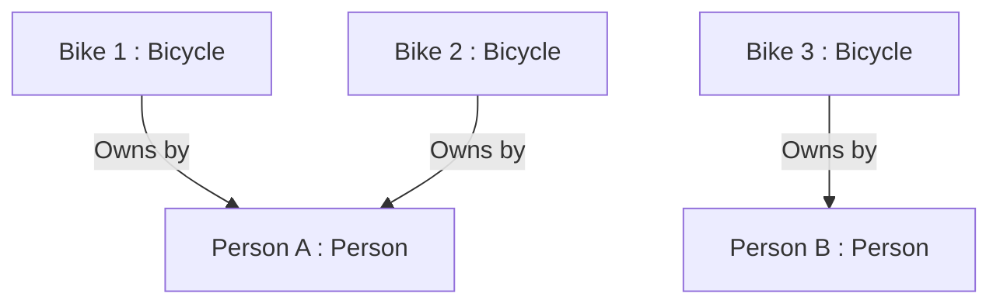

With a *class diagrams*, we do not have access to each instance of *Person* nor *Bicycle*. Thus their representation is more generalized and abstract.

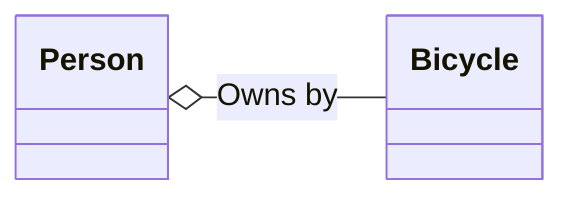

## UML diagram

*UML diagram* is a well known class diagrams with two major components; *classes* and *links*.

Classes in UML diagrams have the following representation;

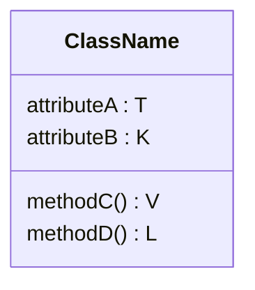

Links represents the relations between two classes. Different types of links provide different relations.

### Annotating UML classes

UML classes contain three sections; the class names, the attributes, and the methods.

Alongside the name of the class itself, additional information about the class is given in the first section of a class. For example, a class could be an abstract class, an interface, or an enumeration class. Such information is annotated as follows;

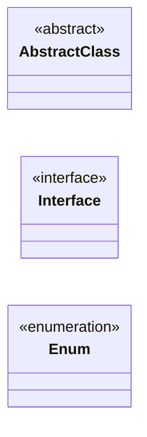


Prefixing fields with $\text{``-"}$ to denote that they are *private*, which means they are accessible only within the same class;

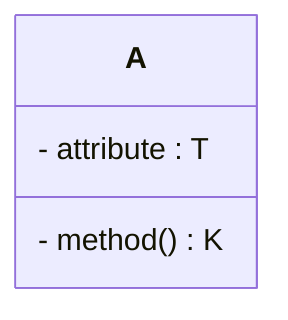

Prefixing fields with $\text{``\#"}$ to denote that they are *protected*, which means they are only accessible within the class and classes which inherits from it;

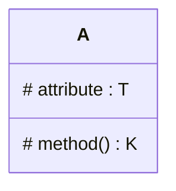

Prefixing fields with $\text{``+"}$ to denoted that they are *public*, which means they are accessible from anywhere;

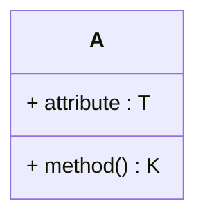

We will use the following keywords to provide additional information on the behaviors of a method; 
- *abstract* denotes an abstract method,
- *virtual* denotes a virtual method,
- *override* denotes an overridden method,
- *query/getter* denotes a query or a getter method,
- *setter* denotes a setter method, and
- *static* denotes a static method.

We will place one or more of these keywords in a pair of brackets after a method's signature to describe its behavior. For example;

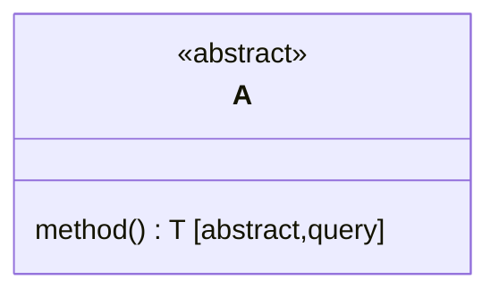

Here, we interpret *method* as an abstract query, which means the subclasses of *A* provide its implementation and it does not modify of an instance.

### Annotating UML links

#### Dependency

Dependency represents a relationship where one or more method of a class uses a method provided by another class. 

An important characteristic of this relation  is the scope. These two classes are  related only during the execution of a method. We use a directed dashed line to denote class dependency. As such, we can interpret the following diagram as; 
- "*A* is dependent on *B*" or 
- "*B* is a dependency of *A*."

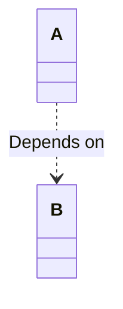

In practice, there are two common characteristics of dependency. A method of *A*  might be hard-coded to invoke a method from *B*;

```python
class B:
	def format(...)
		...
		
class A:
	def solve(...):
		B.format(...)
```

The relation also extends to the scenarios when an instance of *B* is given to a method of *A* as argument;

```python
class B: 
	def format(...)
		...
class A:
	def solve(formatter: B,...):
		formatter.format(...)
```

#### Association

Association indicates that a property of a class holds a reference to one or more instances of another class.

We use a line with solid arrow head to represent association between two classes. We also provide addition labels on the line to introduce more details; the name of the relation, role names, visibility, multiplicities.

**Label**

We label the line to explicitly state the relation. In the following diagram, we can interpret the relation in two ways;
- "*Person* owns *Vehicle*" or
- "*Vehicle* is owned by *Person*."

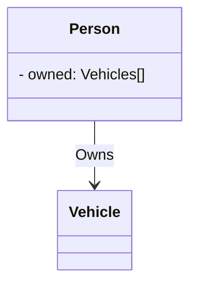

**Multiplicity**

From the example, we do not know how many vehicles a person can own nor do we know the number of owners a vehicle has. We will add multiplicities to both sides. Multiplicities follow a simple convention; $\text{``}n..m\text{"}$. We also use $\text{``*"}$ in cases when $m$ is uncapped.

In our case, we will say that a *Person* can at least zero *Vehicle* with no upper limit, while a *Vehicle* can have no owner or one owner. As such, we can interpret the following diagram as follows;

"a *Person* can own any number of *Vehicle* and a *Vehicle* can have exactly one owner, or no owner at all."

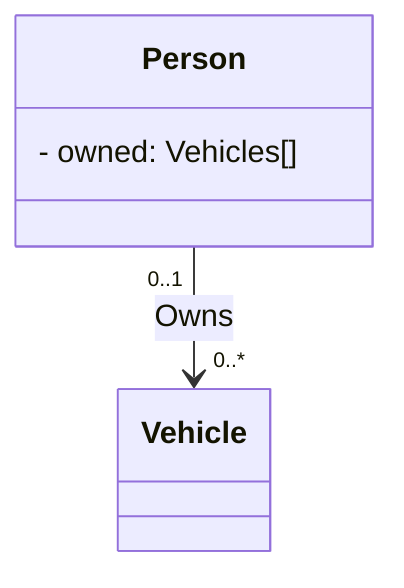

Additionally, we can also provide two more labels; *Ordered* and *Unique* for each multiplicity. In a single moment in time, a *Person* either owns a particular *Vehicle* or they do not, so we can place *Unique* ownership multiplicity. This way, we interpret the relation more clearly as "a *Person* can own any number of unique *Vehicles*."

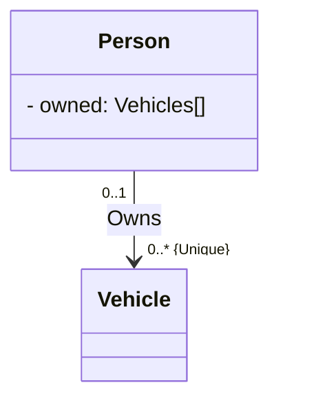

**Role names**

So far, we have the following diagram; 


By using role names, we can move *owned* field of *Person* onto the association itself. We do this to keep ensure that each field is close to their relation while retaining the overall meaning diagram. In the following diagram, we have the following interpretation; "a *Person* has a private field *owned*. The field references zero or more unique *Vehicles*." 

It is worth noting that the visibility modifiers are acceptable here.

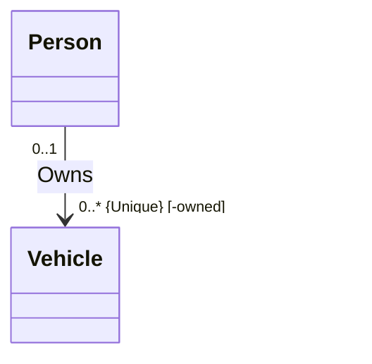

**Association class**

An association class essentially builds on top of association. At this point our diagram has became cluttered with labels. With association classes, we can extract these labels and place them in a pseudo-class. 

However, most object-oriented programming languages do not have support for association class due to one major reason; we can always replace an association class with a regular class.

#### Composition

Composition is a special kind of association. In composition, we have two types of classes; *components* and *entity*. Components come together to form an entity. The components cannot exist outside of an entity, as such, when we destroy an entity, we also destroy all of its component. 

In a simpler term, we will say that a component belongs to one entity throughout its life-cycle, which means it is always part of an entity and it cannot change owner.

For the sake of simplicity, let's say we our entity is a book which has two components; the pages, and the cover. We can model their relation using UML diagram as follows;

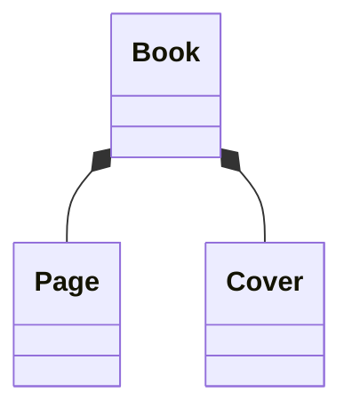

 Of course, this model does not mimic the world, but we will use it for the sake of demonstration. 
 
 **Multiplicity**
 
 Let's introduce a additional information to this diagram. We will say that a book must have at least one page with uncapped upper bound. A book must also have exactly one cover. A page must be inside of a book at all times and the same applies to a cover.

From the given information, we have the following interpretation;
"a *Book* has at least one ordered reference to *Page* and exactly one reference to *Cover*."

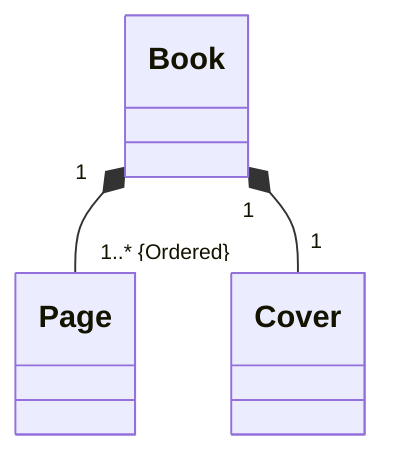

Later in the life cycle of a *Book* we might swap a cover with a new one, doing so, we effectively destroy the old cover.

**Role names**

Much like association, we can introduce role names to explicitly relate the field name with the composition.

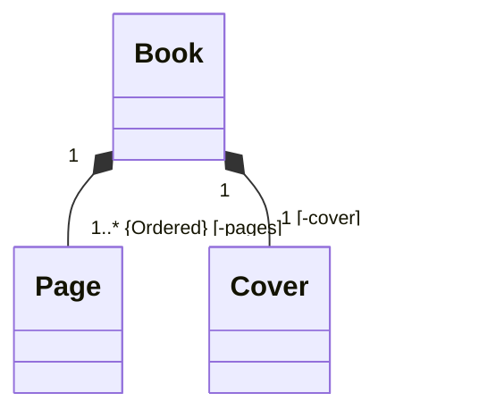

#### Aggregation

Aggregation is another special kind of association. It shares many similarities with composition. Notably, there are two types of classes in aggregation; components and entity, where the components join together to form the entity itself. In this case, a component may belong to multiple entity simultaneously. As such, when we destroy an entity, some of its components live on.

We use a solid line with hollow diamond to indicate aggregation.
Let's modify our *Book* model to better mimic the real world.

In this modified model, we retain most properties with one exception. When we destroy a book, some pages or the cover can still exist.

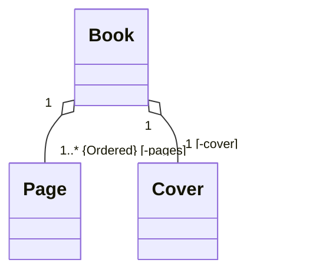

#### Inheritance

Inheritance expresses that a class is a specialized version of another class.

We use a solid line with solid hollow arrowhead to indicate inheritance. In the following diagram; we have two interpretations
- "*Animal* is an generalization of *Cat*" or
- "*Cat* is a specialization of *Animal*."

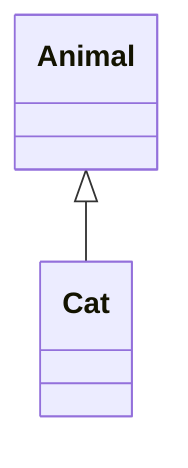